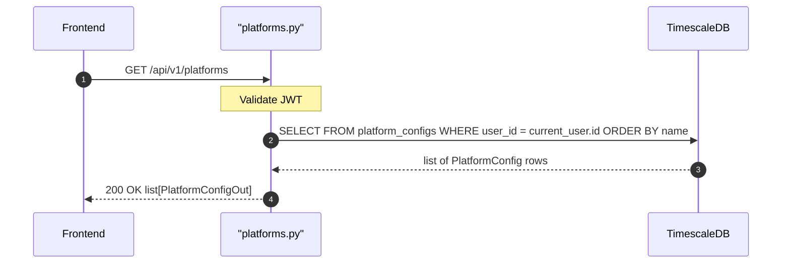

## Overview
Returns all platform color configurations for the authenticated user, ordered alphabetically by platform name. Used by the frontend to render consistent color coding for brokers/platforms across charts and tables.

## 🔒 Authentication
| Field | Value |
| :--- | :--- |
| Required | Yes |
| Mechanism | JWT Bearer token via `get_current_user` |

## 🛠️ Technical Specification

### Request
| Field | Value |
| :--- | :--- |
| Method | `GET` |
| Path | `/api/v1/platforms` |
| Path Params | — |
| Query Params | — |
| Request Body | — |

### Logic Flow


### 📤 Responses
| Status | Description | Body |
| :--- | :--- | :--- |
| 200 | Success | `list[PlatformConfigOut]` |
| 401 | Missing or invalid JWT | `{"detail": "..."}` |

**PlatformConfigOut shape:**
```json
[
  {"name": "Binance", "color": "#F0B90B"},
  {"name": "Robinhood", "color": "#00C805"}
]
```

### 🗂️ Related Files
| Role | File |
| :--- | :--- |
| Router | `backend/app/api/platforms.py` |
| Model | `backend/app/models/platform_config.py` |
| Auth | `backend/app/api/deps.py` |


## 🗂️ Related
- [API-PUT-v1-Platforms-Upsert](API-PUT-v1-Platforms-Upsert)
- [API-DELETE-v1-Platforms-Delete](API-DELETE-v1-Platforms-Delete)
