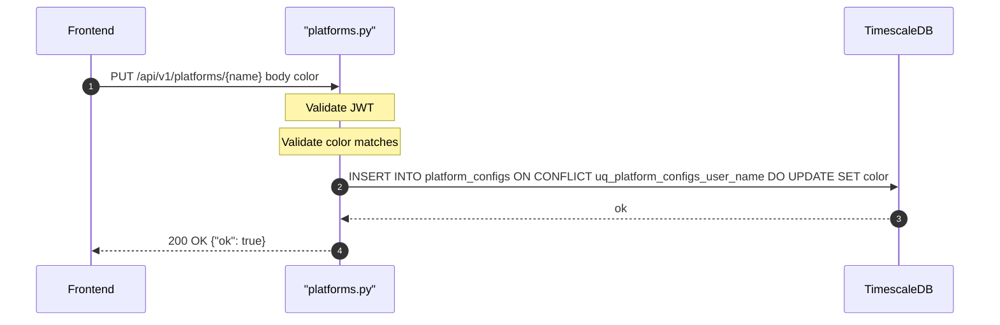

## Overview
Creates or updates the color associated with a named platform for the authenticated user. Uses a PostgreSQL `INSERT ... ON CONFLICT DO UPDATE` against the unique constraint `uq_platform_configs_user_name`, making it idempotent. The platform name is taken from the URL path parameter.

## 🔒 Authentication
| Field | Value |
| :--- | :--- |
| Required | Yes |
| Mechanism | JWT Bearer token via `get_current_user` |

## 🛠️ Technical Specification

### Request
| Field | Value |
| :--- | :--- |
| Method | `PUT` |
| Path | `/api/v1/platforms/{name}` |
| Content-Type | `application/json` |

**Path Parameters:**
| Param | Type | Description |
| :--- | :--- | :--- |
| `name` | `string` | Platform name (e.g. `Binance`, `Robinhood`) |

**Request Body — `PlatformColorIn`:**
| Field | Type | Required | Validation |
| :--- | :--- | :--- | :--- |
| `color` | `string` | Yes | 6-digit hex `#RRGGBB` (validated by `HEX_RE`) |

### Logic Flow

### 📤 Responses
| Status | Description | Body |
| :--- | :--- | :--- |
| 200 | Upserted | `{"ok": true}` |
| 401 | Missing or invalid JWT | `{"detail": "..."}` |
| 422 | Invalid color format | `{"detail": [{"msg": "color must be a 6-digit hex string like #FF6B00"}]}` |

### 🗂️ Related Files
| Role | File |
| :--- | :--- |
| Router | `backend/app/api/platforms.py` |
| Model | `backend/app/models/platform_config.py` |
| Auth | `backend/app/api/deps.py` |

## 🗂️ Related
- [API-GET-v1-Platforms-List](API-GET-v1-Platforms-List)
- [API-DELETE-v1-Platforms-Delete](API-DELETE-v1-Platforms-Delete)
