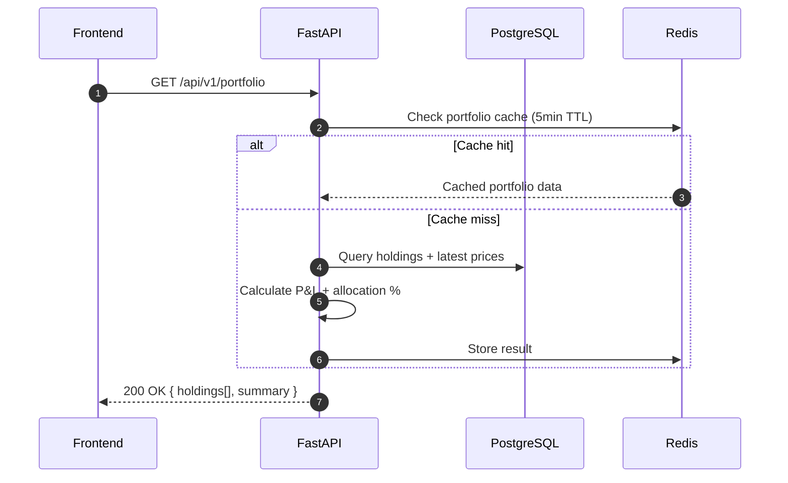

## Overview
<Callout type="abstract">
Returns all of the user's holdings enriched with current market price, P&L (unrealized), and total allocation percentage. This is the primary data source for the Portfolio page and Market Overview dashboard.
</Callout>

## 🔒 Authentication
- **Mechanism:** Bearer JWT

## 🛠️ Technical Specification

### Request
| Parameter | Location | Type | Required | Description |
| :--- | :--- | :--- | :--- | :--- |
| `Authorization` | Header | String | Yes | `Bearer {access_token}` |

### Mermaid Logic



### 📤 Responses

**200 OK**
```json
{
  "summary": {
    "total_value": 125000.00,
    "total_cost": 100000.00,
    "total_pnl": 25000.00,
    "total_pnl_pct": 25.0,
    "currency": "USD"
  },
  "holdings": [
    {
      "id": "uuid",
      "symbol": "AAPL",
      "name": "Apple Inc.",
      "asset_type": "us_stock",
      "quantity": 10,
      "avg_cost_price": 150.00,
      "current_price": 180.00,
      "current_value": 1800.00,
      "pnl": 300.00,
      "pnl_pct": 20.0,
      "allocation_pct": 1.44,
      "latest_verdict": "hold",
      "currency": "USD"
    }
  ]
}
```

**401 Unauthorized**

### 🗂️ Related Files
| Role | Path |
| :--- | :--- |
| Router | `backend/app/api/portfolio.py` |
| Service | `backend/app/services/portfolio.py` |
| Schema | `backend/app/schemas/portfolio.py` |
