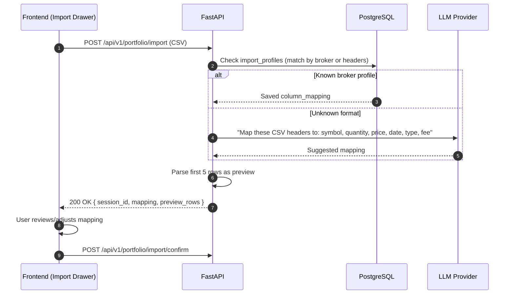

## Overview
<Callout type="abstract">
Accepts a CSV file upload, detects the broker format, and returns a column mapping preview before committing. Uses saved import_profiles for known brokers, falls back to LLM-based column detection for unknown formats.
</Callout>

## 🔒 Authentication
- **Mechanism:** Bearer JWT

## 🛠️ Technical Specification

### Request
| Parameter | Location | Type | Required | Description |
| :--- | :--- | :--- | :--- | :--- |
| `Authorization` | Header | String | Yes | `Bearer {access_token}` |
| `Content-Type` | Header | String | Yes | `multipart/form-data` |
| `file` | Body | File | Yes | CSV file |
| `platform_id` | Body | UUID | No | Hint: which broker this CSV is from |

### Mermaid Logic



### 📤 Responses

**200 OK**
```json
{
  "session_id": "uuid",
  "detected_broker": "Schwab",
  "mapping": {
    "Symbol": "symbol",
    "Quantity": "quantity",
    "Price": "price",
    "Date": "executed_at",
    "Action": "type",
    "Fees & Comm": "fee"
  },
  "preview_rows": [
    { "Symbol": "AAPL", "Quantity": "10", "Price": "150.00", ... }
  ],
  "total_rows": 42
}
```

**400 Bad Request** — Invalid CSV format

**401 Unauthorized**

### 🗂️ Related Files
| Role | Path |
| :--- | :--- |
| Router | `backend/app/api/portfolio.py` |
| Service | `backend/app/services/import_service.py` |
| Schema | `backend/app/schemas/portfolio.py` |
