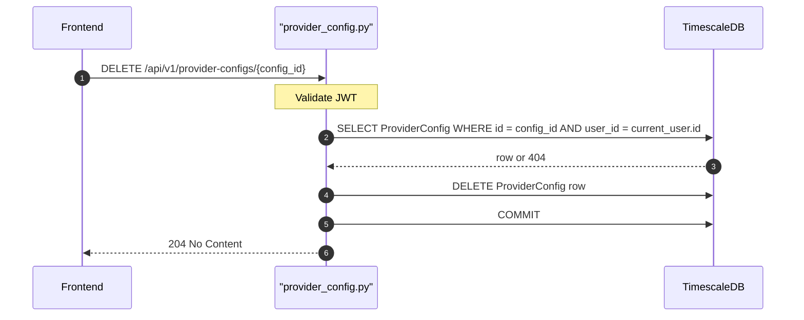

## Overview
Permanently deletes a provider config owned by the authenticated user. The encrypted API key is removed from the database. If any FeatureLLMConfig references this provider config, those records may be left with a dangling FK — check for cascade behavior in the migration.

## 🔒 Authentication
| Field | Value |
| :--- | :--- |
| Required | Yes |
| Mechanism | JWT Bearer token via `get_current_user` |

## 🛠️ Technical Specification

### Request
| Field | Value |
| :--- | :--- |
| Method | `DELETE` |
| Path | `/api/v1/provider-configs/{config_id}` |
| Request Body | — |

**Path Parameters:**
| Param | Type | Description |
| :--- | :--- | :--- |
| `config_id` | `uuid` | ID of the ProviderConfig to delete |

### Logic Flow

### 📤 Responses
| Status | Description | Body |
| :--- | :--- | :--- |
| 204 | Deleted | — |
| 401 | Missing or invalid JWT | `{"detail": "..."}` |
| 404 | Config not found or not owned | `{"detail": "Provider config not found"}` |

### 🗂️ Related Files
| Role | File |
| :--- | :--- |
| Router | `backend/app/api/provider_config.py` |
| Model | `backend/app/models/provider_config.py` |
| Auth | `backend/app/api/auth.py` |

## 🗂️ Related
- [API-GET-v1-ProviderConfig-List](API-GET-v1-ProviderConfig-List)
- [API-POST-v1-ProviderConfig-Create](API-POST-v1-ProviderConfig-Create)
- [API-PATCH-v1-ProviderConfig-Update](API-PATCH-v1-ProviderConfig-Update)
- [API-POST-v1-ProviderConfig-TestConnection](API-POST-v1-ProviderConfig-TestConnection)
- [API-POST-v1-ProviderConfig-FetchModels](API-POST-v1-ProviderConfig-FetchModels)
