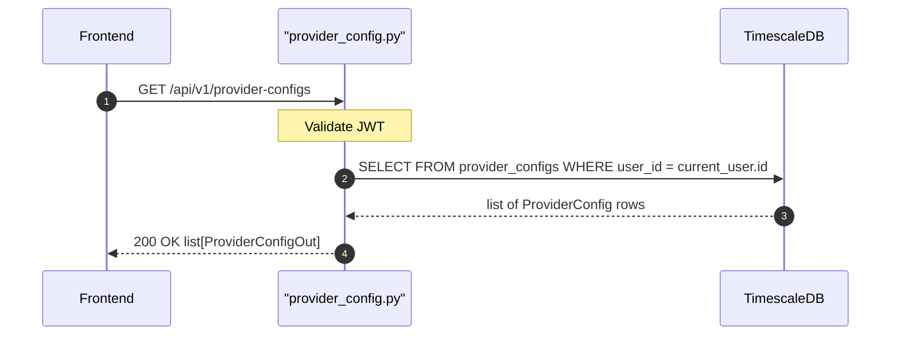

## Overview
Returns all LLM provider configurations belonging to the authenticated user. Encrypted API keys are never returned — the `ProviderConfigOut` schema exposes only safe fields.

## 🔒 Authentication
| Field | Value |
| :--- | :--- |
| Required | Yes |
| Mechanism | JWT Bearer token via `get_current_user` |

## 🛠️ Technical Specification

### Request
| Field | Value |
| :--- | :--- |
| Method | `GET` |
| Path | `/api/v1/provider-configs` |
| Path Params | — |
| Query Params | — |
| Request Body | — |

### Logic Flow


### 📤 Responses
| Status | Description | Body |
| :--- | :--- | :--- |
| 200 | Success | `list[ProviderConfigOut]` |
| 401 | Missing or invalid JWT | `{"detail": "..."}` |

**ProviderConfigOut shape (api_key omitted):**
```json
[
  {
    "id": "uuid",
    "provider": "openai",
    "host_url": null,
    "is_connected": true,
    "models_cache": ["gpt-4o", "gpt-4o-mini"],
    "models_fetched_at": "2026-05-11T00:00:00Z",
    "created_at": "2026-05-11T00:00:00Z",
    "updated_at": "2026-05-11T00:00:00Z"
  }
]
```

### 🗂️ Related Files
| Role | File |
| :--- | :--- |
| Router | `backend/app/api/provider_config.py` |
| Schema | `backend/app/schemas/provider_config.py` |
| Model | `backend/app/models/provider_config.py` |
| Encryption | `backend/app/core/encryption.py` |
| Auth | `backend/app/api/auth.py` |


## 🗂️ Related
- [API-POST-v1-ProviderConfig-Create](API-POST-v1-ProviderConfig-Create)
- [API-PATCH-v1-ProviderConfig-Update](API-PATCH-v1-ProviderConfig-Update)
- [API-DELETE-v1-ProviderConfig-Delete](API-DELETE-v1-ProviderConfig-Delete)
- [API-POST-v1-ProviderConfig-TestConnection](API-POST-v1-ProviderConfig-TestConnection)
- [API-POST-v1-ProviderConfig-FetchModels](API-POST-v1-ProviderConfig-FetchModels)
