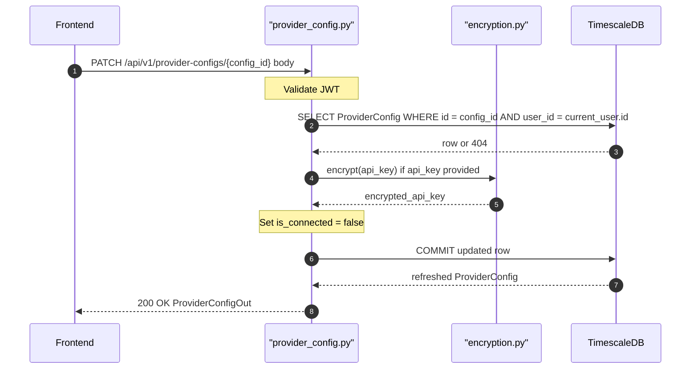

## Overview
Partially updates a provider config owned by the authenticated user. Allows changing the API key (re-encrypted) and/or `host_url`. Automatically resets `is_connected` to `false` since credentials have changed and connectivity is unverified.

## 🔒 Authentication
| Field | Value |
| :--- | :--- |
| Required | Yes |
| Mechanism | JWT Bearer token via `get_current_user` |

## 🛠️ Technical Specification

### Request
| Field | Value |
| :--- | :--- |
| Method | `PATCH` |
| Path | `/api/v1/provider-configs/{config_id}` |
| Content-Type | `application/json` |

**Path Parameters:**
| Param | Type | Description |
| :--- | :--- | :--- |
| `config_id` | `uuid` | ID of the ProviderConfig to update |

**Request Body — `ProviderConfigUpdate` (all optional):**
| Field | Type | Notes |
| :--- | :--- | :--- |
| `api_key` | `string` | Re-encrypted before storage |
| `host_url` | `string` | New host URL for local providers |

### Logic Flow

### 📤 Responses
| Status | Description | Body |
| :--- | :--- | :--- |
| 200 | Updated | `ProviderConfigOut` |
| 401 | Missing or invalid JWT | `{"detail": "..."}` |
| 404 | Config not found or not owned | `{"detail": "Provider config not found"}` |

### 🗂️ Related Files
| Role | File |
| :--- | :--- |
| Router | `backend/app/api/provider_config.py` |
| Schema | `backend/app/schemas/provider_config.py` |
| Encryption | `backend/app/core/encryption.py` |
| Auth | `backend/app/api/auth.py` |

## 🗂️ Related
- [API-GET-v1-ProviderConfig-List](API-GET-v1-ProviderConfig-List)
- [API-POST-v1-ProviderConfig-Create](API-POST-v1-ProviderConfig-Create)
- [API-DELETE-v1-ProviderConfig-Delete](API-DELETE-v1-ProviderConfig-Delete)
- [API-POST-v1-ProviderConfig-TestConnection](API-POST-v1-ProviderConfig-TestConnection)
- [API-POST-v1-ProviderConfig-FetchModels](API-POST-v1-ProviderConfig-FetchModels)
