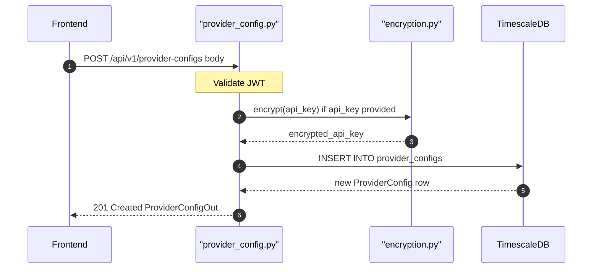

## Overview
Creates a new LLM provider configuration for the authenticated user. The API key is encrypted at rest using the application encryption module before being stored. Supports both cloud providers (with API key) and local providers like Ollama (with `host_url`, no key required).

## 🔒 Authentication
| Field | Value |
| :--- | :--- |
| Required | Yes |
| Mechanism | JWT Bearer token via `get_current_user` |

## 🛠️ Technical Specification

### Request
| Field | Value |
| :--- | :--- |
| Method | `POST` |
| Path | `/api/v1/provider-configs` |
| Content-Type | `application/json` |

**Request Body — `ProviderConfigCreate`:**
| Field | Type | Required | Notes |
| :--- | :--- | :--- | :--- |
| `provider` | `string` | Yes | e.g. `openai`, `anthropic`, `ollama` |
| `api_key` | `string` | No | Encrypted before storage; omit for local providers |
| `host_url` | `string` | No | Required for local providers (e.g. Ollama) |

### Logic Flow

### 📤 Responses
| Status | Description | Body |
| :--- | :--- | :--- |
| 201 | Created | `ProviderConfigOut` |
| 401 | Missing or invalid JWT | `{"detail": "..."}` |
| 422 | Validation error | FastAPI validation detail |

### 🗂️ Related Files
| Role | File |
| :--- | :--- |
| Router | `backend/app/api/provider_config.py` |
| Schema | `backend/app/schemas/provider_config.py` |
| Model | `backend/app/models/provider_config.py` |
| Encryption | `backend/app/core/encryption.py` |
| Auth | `backend/app/api/auth.py` |

## 🗂️ Related
- [API-GET-v1-ProviderConfig-List](API-GET-v1-ProviderConfig-List)
- [API-PATCH-v1-ProviderConfig-Update](API-PATCH-v1-ProviderConfig-Update)
- [API-DELETE-v1-ProviderConfig-Delete](API-DELETE-v1-ProviderConfig-Delete)
- [API-POST-v1-ProviderConfig-TestConnection](API-POST-v1-ProviderConfig-TestConnection)
- [API-POST-v1-ProviderConfig-FetchModels](API-POST-v1-ProviderConfig-FetchModels)
