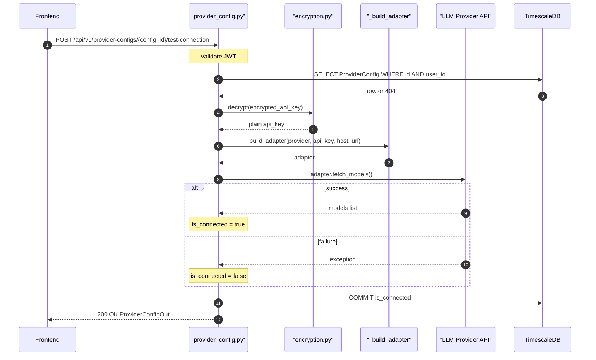

## Overview
Attempts to connect to the configured LLM provider by decrypting the stored API key, building an adapter via `_build_adapter`, and calling `adapter.fetch_models()`. Sets `is_connected = true` on success or `false` on failure, then persists the updated state. Never throws 5xx — connection failures are recorded silently and reflected in the response.

## 🔒 Authentication
| Field | Value |
| :--- | :--- |
| Required | Yes |
| Mechanism | JWT Bearer token via `get_current_user` |

## 🛠️ Technical Specification

### Request
| Field | Value |
| :--- | :--- |
| Method | `POST` |
| Path | `/api/v1/provider-configs/{config_id}/test-connection` |
| Request Body | — (none) |

**Path Parameters:**
| Param | Type | Description |
| :--- | :--- | :--- |
| `config_id` | `uuid` | ID of the ProviderConfig to test |

### Logic Flow

### 📤 Responses
| Status | Description | Body |
| :--- | :--- | :--- |
| 200 | Test complete (check `is_connected`) | `ProviderConfigOut` |
| 401 | Missing or invalid JWT | `{"detail": "..."}` |
| 404 | Config not found or not owned | `{"detail": "Provider config not found"}` |

### 🗂️ Related Files
| Role | File |
| :--- | :--- |
| Router | `backend/app/api/provider_config.py` |
| Gateway | `backend/app/services/llm_gateway.py` (`_build_adapter`) |
| Encryption | `backend/app/core/encryption.py` |
| Auth | `backend/app/api/auth.py` |

## 🗂️ Related
- [API-GET-v1-ProviderConfig-List](API-GET-v1-ProviderConfig-List)
- [API-POST-v1-ProviderConfig-Create](API-POST-v1-ProviderConfig-Create)
- [API-POST-v1-ProviderConfig-FetchModels](API-POST-v1-ProviderConfig-FetchModels)
