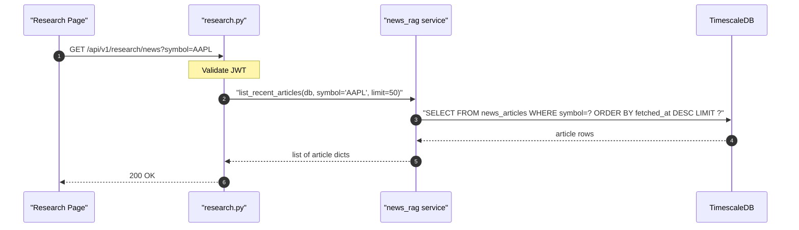

## Overview

Returns recent news articles from the ChromaDB RAG store, optionally filtered by asset symbol. Returns at most 100 articles. Used by the Research page to display the news library indexed by the worker.

## 🔒 Authentication

| Field | Value |
| :--- | :--- |
| Required | Yes |
| Mechanism | JWT Bearer token via `get_current_user` |

## 🛠️ Technical Specification

### Request

| Field | Value |
| :--- | :--- |
| Method | `GET` |
| Path | `/api/v1/research/news` |

| Query param | Type | Default | Notes |
| :--- | :--- | :--- | :--- |
| `symbol` | string | — | Filter to a specific ticker symbol |
| `limit` | int | `50` | Max `100` (capped server-side) |

### Logic Flow

### 📤 Responses

**200 OK** — list of news article objects (may be empty if no articles indexed)

**401 Unauthorized**

### 🗂️ Related Files

| Role | File |
| :--- | :--- |
| Router | `backend/app/api/research.py` |
| Service | `backend/app/services/news_rag.py` → `list_recent_articles()` |
| Model | `backend/app/models/news_article.py` |
| Frontend | `frontend/app/(auth)/research/page.tsx` |

## 🗂️ Related

- [DB - news_articles](/en/docs/zentri/database/db-news-articles)
- [Page - Research](/en/docs/zentri/frontend/pages/page-research)
