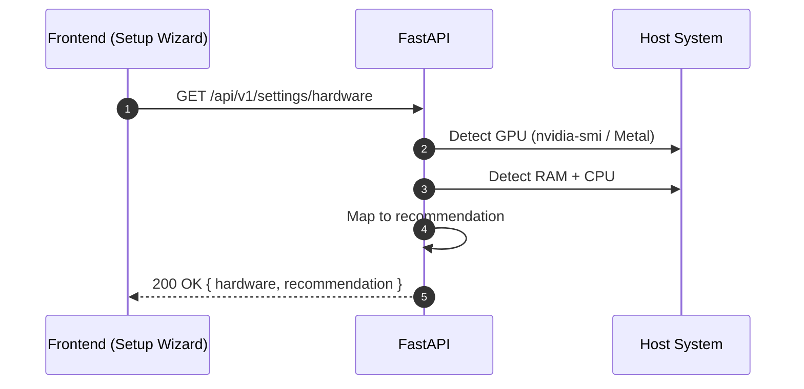

## Overview
<Callout type="abstract">
Detects the host machine's hardware capabilities (GPU VRAM, RAM, CPU, Apple Silicon) and returns an LLM configuration recommendation. Called during the setup wizard and displayed on the Settings page so the user knows what local models they can run.
</Callout>

## 🔒 Authentication
- **Mechanism:** Bearer JWT

## 🛠️ Technical Specification

### Request
| Parameter | Location | Type | Required | Description |
| :--- | :--- | :--- | :--- | :--- |
| `Authorization` | Header | String | Yes | `Bearer {access_token}` |

### Mermaid Logic



### 📤 Responses

**200 OK — NVIDIA GPU example**
```json
{
  "hardware": {
    "gpu_name": "NVIDIA RTX 3070 Ti",
    "gpu_vram_gb": 8,
    "ram_gb": 32,
    "cpu": "AMD Ryzen 9 5900X",
    "platform": "linux"
  },
  "recommendation": {
    "can_run_local_llm": true,
    "recommended_model": "mistral:7b-q4",
    "setup_command": "docker compose --profile local-llm up",
    "note": "8GB VRAM supports 7B quantized models. Use cloud LLM for deep analysis."
  }
}
```

**200 OK — Apple Silicon example**
```json
{
  "hardware": {
    "chip": "Apple M3 Pro",
    "unified_memory_gb": 18,
    "platform": "darwin"
  },
  "recommendation": {
    "can_run_local_llm": true,
    "recommended_model": "llama3.1:8b",
    "setup_command": "brew install ollama && ollama pull llama3.1:8b",
    "note": "Run Ollama natively on Mac for Metal GPU acceleration. Docker cannot access Metal."
  }
}
```

**401 Unauthorized**

### 🗂️ Related Files
| Role | Path |
| :--- | :--- |
| Router | `backend/app/api/settings.py` |
| Service | `backend/app/services/hardware_detect.py` |
