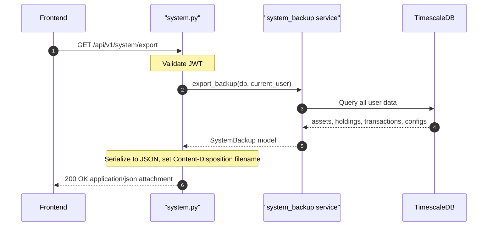

## Overview
Exports a full backup of the authenticated user's data as a downloadable JSON file. Delegates to `backup_service.export_backup()` to collect all user data into a `SystemBackup` Pydantic model, then returns it as an attachment with a timestamped filename.

## 🔒 Authentication
| Field | Value |
| :--- | :--- |
| Required | Yes |
| Mechanism | JWT Bearer token via `get_current_user` |

## 🛠️ Technical Specification

### Request
| Field | Value |
| :--- | :--- |
| Method | `GET` |
| Path | `/api/v1/system/export` |
| Path Params | — |
| Query Params | — |
| Request Body | — |

### Logic Flow


### 📤 Responses
| Status | Description | Body |
| :--- | :--- | :--- |
| 200 | Export ready | `SystemBackup` as JSON attachment |
| 401 | Missing or invalid JWT | `{"detail": "..."}` |

**Response Headers:**
```
Content-Disposition: attachment; filename="zentri-backup-2026-05-11_120000.json"
Content-Type: application/json
```

**SystemBackup shape** (from `app.schemas.system_backup`):
```json
{
  "version": "1.0",
  "exported_at": "2026-05-11T12:00:00Z",
  "assets": [...],
  "holdings": [...],
  "transactions": [...],
  "provider_configs": [...],
  "feature_llm_configs": [...]
}
```

### 🗂️ Related Files
| Role | File |
| :--- | :--- |
| Router | `backend/app/api/system.py` |
| Service | `backend/app/services/system_backup.py` |
| Schema | `backend/app/schemas/system_backup.py` (`SystemBackup`) |
| Auth | `backend/app/api/deps.py` |


## 🗂️ Related
- [API-POST-v1-System-Import](API-POST-v1-System-Import)
