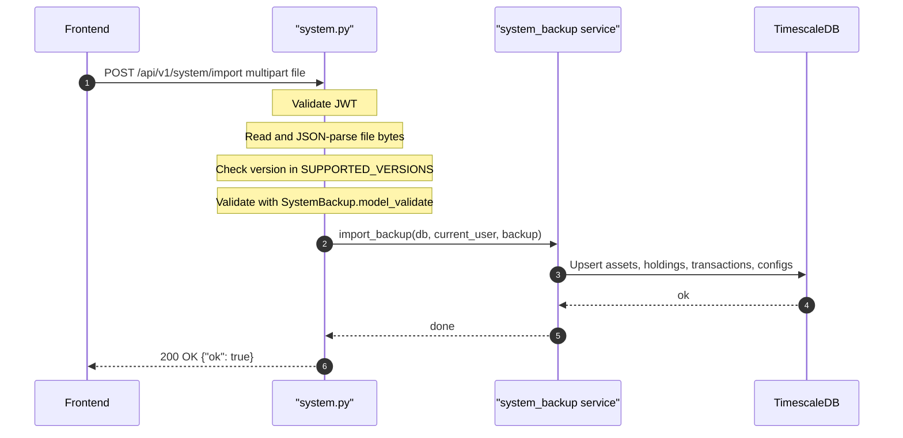

## Overview
Restores user data from a previously exported backup JSON file. Validates the file version against `SUPPORTED_VERSIONS`, parses it into a `SystemBackup` Pydantic model, then delegates to `backup_service.import_backup()` to write the data into the DB. Returns 400 for invalid JSON, unsupported version, or malformed backup structure.

## 🔒 Authentication
| Field | Value |
| :--- | :--- |
| Required | Yes |
| Mechanism | JWT Bearer token via `get_current_user` |

## 🛠️ Technical Specification

### Request
| Field | Value |
| :--- | :--- |
| Method | `POST` |
| Path | `/api/v1/system/import` |
| Content-Type | `multipart/form-data` |

**Form Fields:**
| Field | Type | Required | Description |
| :--- | :--- | :--- | :--- |
| `file` | `UploadFile` | Yes | JSON backup file produced by `/system/export` |

### Logic Flow

### 📤 Responses
| Status | Description | Body |
| :--- | :--- | :--- |
| 200 | Import complete | `{"ok": true}` |
| 400 | Invalid JSON file | `{"detail": "Invalid JSON file"}` |
| 400 | Unsupported version | `{"detail": "Unsupported backup version: <v>"}` |
| 400 | Invalid backup format | `{"detail": "Invalid backup format: <error>"}` |
| 401 | Missing or invalid JWT | `{"detail": "..."}` |

### 🗂️ Related Files
| Role | File |
| :--- | :--- |
| Router | `backend/app/api/system.py` |
| Service | `backend/app/services/system_backup.py` |
| Schema | `backend/app/schemas/system_backup.py` (`SystemBackup`) |
| Auth | `backend/app/api/deps.py` |

## 🗂️ Related
- [API-GET-v1-System-Export](API-GET-v1-System-Export)
