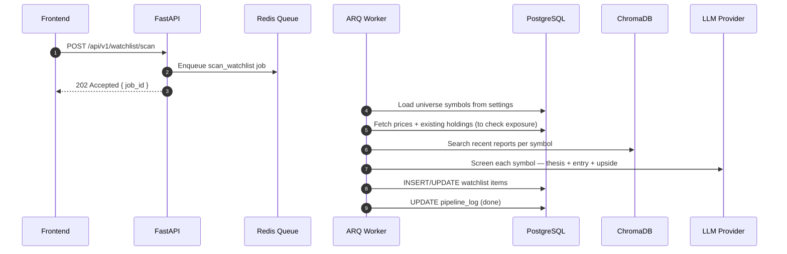

## Overview
<Callout type="abstract">
Triggers the AI discovery scan across the user's configured universe (stocks/crypto/funds they want Zentri to monitor). The worker screens assets for fundamental strength, relative value, and portfolio fit — then surfaces candidates as watchlist items with AI thesis and suggested entry price.
</Callout>

## 🔒 Authentication
- **Mechanism:** Bearer JWT

## 🛠️ Technical Specification

### Request
| Parameter | Location | Type | Required | Description |
| :--- | :--- | :--- | :--- | :--- |
| `Authorization` | Header | String | Yes | `Bearer {access_token}` |

### Mermaid Logic



### 📤 Responses

**202 Accepted**
```json
{
  "job_id": "uuid",
  "message": "Watchlist scan queued. Results will appear on /watchlist when complete."
}
```

**401 Unauthorized**

**400 Bad Request** — Universe not configured. Set up in Settings → Universe.

### 🗂️ Related Files
| Role | Path |
| :--- | :--- |
| Router | `backend/app/api/watchlist.py` |
| Worker Job | `backend/worker/jobs/scan_watchlist.py` |
| Service | `backend/app/services/watchlist.py` |
