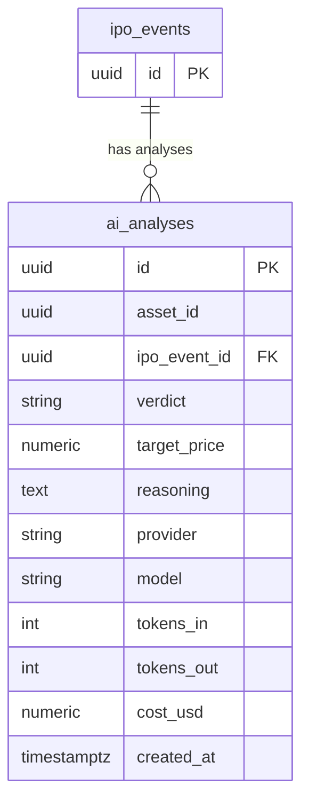

## Table Info
| Field | Value |
| :--- | :--- |
| Table | `ai_analyses` |
| Engine | TimescaleDB (Postgres 16) |
| Model file | `backend/app/models/ai_analysis.py` |
| Primary key | UUID (`id`) |
| Purpose | Stores per-asset or per-IPO AI analysis results including verdict, target price, reasoning, and token/cost tracking |

## Columns
| Column | Type | Nullable | Default | Notes |
| :--- | :--- | :--- | :--- | :--- |
| `id` | UUID | NO | `uuid.uuid4()` | Primary key |
| `asset_id` | UUID | YES | — | Reference to asset (no FK constraint) |
| `ipo_event_id` | UUID | YES | — | FK → `ipo_events.id` |
| `job_id` | VARCHAR | YES | — | ARQ job identifier |
| `verdict` | VARCHAR | NO | — | AI verdict string (e.g. BUY / HOLD / SELL) |
| `target_price` | NUMERIC(20,8) | YES | — | Price target in asset currency |
| `reasoning` | TEXT | NO | — | Full LLM reasoning text |
| `provider` | VARCHAR | NO | — | LLM provider name (e.g. openai) |
| `model` | VARCHAR | NO | — | Model identifier used |
| `tokens_in` | INTEGER | NO | `0` | Input tokens consumed |
| `tokens_out` | INTEGER | NO | `0` | Output tokens consumed |
| `cost_usd` | NUMERIC(10,6) | NO | `0` | Computed cost in USD |
| `created_at` | TIMESTAMPTZ | NO | `now()` | Record creation time |

## Constraints & Indexes
| Name | Type | Columns |
| :--- | :--- | :--- |
| `ai_analyses_pkey` | PRIMARY KEY | `id` |
| `ai_analyses_ipo_event_id_fkey` | FOREIGN KEY | `ipo_event_id` → `ipo_events.id` |

## Entity Relationships


## SQLAlchemy Model (reference snapshot)
```python
class AIAnalysis(Base):
    __tablename__ = "ai_analyses"

    id: Mapped[uuid.UUID] = mapped_column(UUID(as_uuid=True), primary_key=True, default=uuid.uuid4)
    asset_id: Mapped[uuid.UUID | None] = mapped_column(UUID(as_uuid=True), nullable=True)
    ipo_event_id: Mapped[uuid.UUID | None] = mapped_column(
        UUID(as_uuid=True), ForeignKey("ipo_events.id"), nullable=True
    )
    job_id: Mapped[str | None] = mapped_column(nullable=True)
    verdict: Mapped[str] = mapped_column(nullable=False)
    target_price: Mapped[Decimal | None] = mapped_column(Numeric(20, 8), nullable=True)
    reasoning: Mapped[str] = mapped_column(Text, nullable=False)
    provider: Mapped[str] = mapped_column(nullable=False)
    model: Mapped[str] = mapped_column(nullable=False)
    tokens_in: Mapped[int] = mapped_column(Integer, default=0)
    tokens_out: Mapped[int] = mapped_column(Integer, default=0)
    cost_usd: Mapped[Decimal] = mapped_column(Numeric(10, 6), default=0)
    created_at: Mapped[datetime] = mapped_column(
        DateTime(timezone=True), default=lambda: datetime.now(timezone.utc)
    )
```

## TimescaleDB Notes
Standard Postgres table. Not a hypertable. No time-series partitioning applied.

## Service Layer
| Layer | File | Purpose |
| :--- | :--- | :--- |
| API | `backend/app/api/analysis.py` | Exposes analysis read endpoints |
| API | `backend/app/api/ipos.py` | Reads analyses for IPO events |
| API | `backend/app/api/watchlist.py` | Reads analyses for watchlist items |
| Service | `backend/app/services/system_backup.py` | Includes in backup/restore |
| Worker | `backend/worker/jobs/run_analysis.py` | Creates analysis records after LLM call |
| Worker | `backend/worker/jobs/watchlist_scan.py` | Creates analysis records for watchlist scan |

## Related
- DB - ipo_events
- DB - overview_analyses
- DB - llm_conversations
- DB - provider_configs
