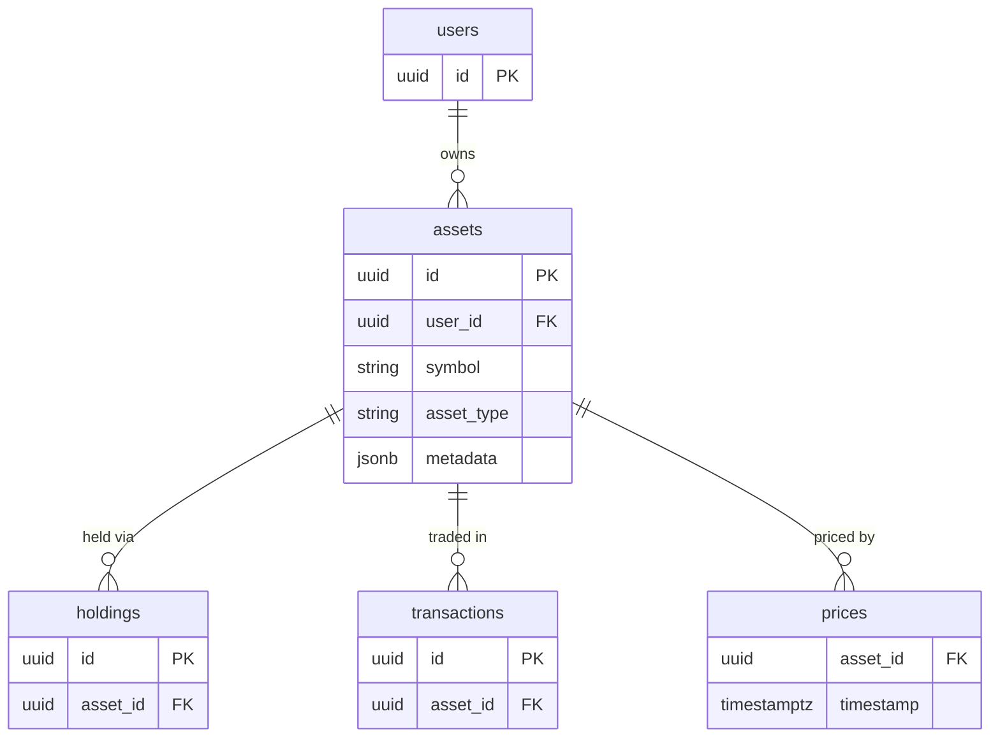

## Table Info
| Field | Value |
| :--- | :--- |
| Table | `assets` |
| Engine | TimescaleDB (Postgres 16) |
| Model file | `backend/app/models/asset.py` |
| Primary key | UUID (auto-generated via `uuid.uuid4`) |

## Columns
| Column | Type | Nullable | Default | Notes |
| :--- | :--- | :--- | :--- | :--- |
| `id` | UUID | No | `uuid.uuid4()` | Primary key |
| `user_id` | UUID | No | — | FK → `users.id`, indexed |
| `symbol` | String(30) | No | — | Ticker symbol, e.g. `AAPL`, `BTC` |
| `asset_type` | Enum(`asset_type_enum`) | No | — | One of: `us_stock`, `thai_stock`, `thai_dr`, `th_fund`, `etf`, `crypto`, `gold`, `cash` |
| `name` | String(255) | No | — | Human-readable asset name |
| `currency` | String(10) | No | `"USD"` | Trading currency of the asset |
| `metadata_` | JSONB | No | `{}` | Flexible extra fields (maps to DB column `metadata`) |
| `created_at` | DateTime(tz) | No | `datetime.now(utc)` | Record creation timestamp |

## Constraints & Indexes
| Name | Type | Columns |
| :--- | :--- | :--- |
| `pk_assets` | PRIMARY KEY | `id` |
| `fk_assets_user_id` | FOREIGN KEY | `user_id` → `users.id` |
| `ix_assets_user_id` | INDEX | `user_id` |
| `asset_type_enum` | DB ENUM TYPE | `asset_type` domain |

## Entity Relationships


## SQLAlchemy Model (reference snapshot)
```python
ASSET_TYPES = ("us_stock", "thai_stock", "thai_dr", "th_fund", "etf", "crypto", "gold", "cash")

class Asset(Base):
    __tablename__ = "assets"

    id: Mapped[uuid.UUID] = mapped_column(UUID(as_uuid=True), primary_key=True, default=uuid.uuid4)
    user_id: Mapped[uuid.UUID] = mapped_column(UUID(as_uuid=True), ForeignKey("users.id"), nullable=False, index=True)
    symbol: Mapped[str] = mapped_column(String(30), nullable=False)
    asset_type: Mapped[str] = mapped_column(
        Enum(*ASSET_TYPES, name="asset_type_enum"), nullable=False
    )
    name: Mapped[str] = mapped_column(String(255), nullable=False)
    currency: Mapped[str] = mapped_column(String(10), nullable=False, default="USD")
    metadata_: Mapped[dict] = mapped_column("metadata", JSONB, nullable=False, default=dict)
    created_at: Mapped[datetime] = mapped_column(
        DateTime(timezone=True), default=lambda: datetime.now(timezone.utc)
    )
```

## TimescaleDB Notes
Standard Postgres table. Not a hypertable. The related `prices` table is the intended hypertable candidate for time-series price data keyed by `asset_id`.

## Service Layer
| Layer | File | Purpose |
| :--- | :--- | :--- |
| Service | `app/services/asset.py` | CRUD for assets |
| Service | `app/services/portfolio.py` | Aggregates holdings per asset |
| Service | `app/services/overview.py` | Portfolio overview including asset data |
| Service | `app/services/price_feed.py` | Fetches prices for each asset |
| Service | `app/services/chat_tools.py` | AI chat context: asset lookups |
| Service | `app/services/net_worth_snapshot.py` | Snapshots net worth across assets |
| Service | `app/services/dividend_alert.py` | Resolves assets for dividend checks |
| Service | `app/services/watchlist_alert.py` | Price alerts per asset |
| Service | `app/services/system_backup.py` | Exports asset records |
| API Router | `app/api/portfolio.py` | Portfolio endpoints |
| API Router | `app/api/import_pipeline.py` | Bulk asset import |
| API Router | `app/api/watchlist.py` | Watchlist management |
| API Router | `app/api/dividends.py` | Dividend tracking |
| API Router | `app/api/analysis.py` | Per-asset analysis |
| API Router | `app/api/documents.py` | Asset-linked documents |

## Related
- DB - users
- DB - holdings
- DB - transactions
- DB - prices
