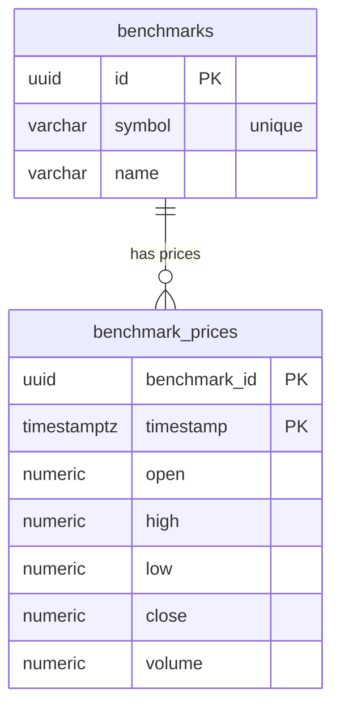

## Table Info
| Field | Value |
| :--- | :--- |
| Table | `benchmarks` (+ child table `benchmark_prices`) |
| Engine | TimescaleDB (Postgres 16) |
| Model file | `backend/app/models/benchmark.py` |
| Primary key | `benchmarks`: UUID (`id`); `benchmark_prices`: composite (`benchmark_id`, `timestamp`) |

## Columns

### benchmarks
| Column | Type | Nullable | Default | Notes |
| :--- | :--- | :--- | :--- | :--- |
| `id` | UUID | No | `uuid.uuid4` | Primary key |
| `symbol` | String(30) | No | — | Unique ticker symbol (e.g. "SPY") |
| `name` | String(255) | No | — | Human-readable benchmark name |

### benchmark_prices
| Column | Type | Nullable | Default | Notes |
| :--- | :--- | :--- | :--- | :--- |
| `benchmark_id` | UUID | No | — | FK → `benchmarks.id`, part of composite PK |
| `timestamp` | DateTime(tz) | No | — | Price bar timestamp, part of composite PK |
| `open` | Numeric(20,8) | Yes | NULL | Opening price |
| `high` | Numeric(20,8) | Yes | NULL | High price |
| `low` | Numeric(20,8) | Yes | NULL | Low price |
| `close` | Numeric(20,8) | No | — | Closing price (required) |
| `volume` | Numeric(20,8) | Yes | NULL | Trading volume |

## Constraints & Indexes
| Name | Type | Columns |
| :--- | :--- | :--- |
| `benchmarks_pkey` | Primary Key | `id` |
| `ix_benchmarks_symbol` | Unique | `symbol` |
| `benchmark_prices_pkey` | Composite Primary Key | `benchmark_id`, `timestamp` |
| FK on `benchmark_id` | Foreign Key | `benchmark_id` → `benchmarks.id` |

## Entity Relationships


## SQLAlchemy Model (reference snapshot)
```python
class Benchmark(Base):
    __tablename__ = "benchmarks"

    id: Mapped[uuid.UUID] = mapped_column(
        UUID(as_uuid=True), primary_key=True, default=uuid.uuid4
    )
    symbol: Mapped[str] = mapped_column(String(30), nullable=False, unique=True)
    name: Mapped[str] = mapped_column(String(255), nullable=False)


class BenchmarkPrice(Base):
    __tablename__ = "benchmark_prices"

    benchmark_id: Mapped[uuid.UUID] = mapped_column(
        UUID(as_uuid=True), ForeignKey("benchmarks.id"), primary_key=True
    )
    timestamp: Mapped[datetime] = mapped_column(
        DateTime(timezone=True), primary_key=True
    )
    open: Mapped[Decimal | None] = mapped_column(Numeric(20, 8), nullable=True)
    high: Mapped[Decimal | None] = mapped_column(Numeric(20, 8), nullable=True)
    low: Mapped[Decimal | None] = mapped_column(Numeric(20, 8), nullable=True)
    close: Mapped[Decimal] = mapped_column(Numeric(20, 8), nullable=False)
    volume: Mapped[Decimal | None] = mapped_column(Numeric(20, 8), nullable=True)
```

## TimescaleDB Notes
- `benchmark_prices` is a candidate for a TimescaleDB hypertable on `timestamp` — it is a time-series table with a composite PK already containing the time column.
- Currently not confirmed as a hypertable; check alembic migrations for `select_toolkit_experimental` or `create_hypertable` calls.
- If converted to a hypertable, `timestamp` must be the first element in the composite PK.

## Service Layer
| Layer | File | Purpose |
| :--- | :--- | :--- |
| Service | `backend/app/services/price_feed.py` | Fetches and stores benchmark price data |
| Service | `backend/app/services/overview.py` | Reads benchmark prices for portfolio comparison |

## Related
- DB - assets
- DB - watchlist_items
