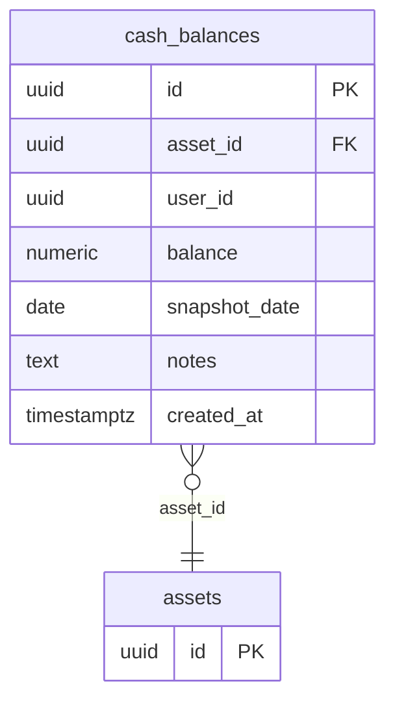

## Table Info
| Field | Value |
| :--- | :--- |
| Table | `cash_balances` |
| Engine | TimescaleDB (Postgres 16) |
| Model file | `backend/app/models/cash_balance.py` |
| Primary key | UUID (`id`) |

## Columns
| Column | Type | Nullable | Default | Notes |
| :--- | :--- | :--- | :--- | :--- |
| `id` | UUID | No | `uuid.uuid4` | Primary key |
| `asset_id` | UUID | No | — | FK → `assets.id`, indexed |
| `user_id` | UUID | No | — | Indexed; no FK constraint in model |
| `balance` | Numeric(20,6) | No | — | Cash amount with 6 decimal places |
| `snapshot_date` | Date | No | — | The date of the balance record |
| `notes` | Text | Yes | NULL | Optional free-text annotation |
| `created_at` | DateTime(tz) | No | `datetime.now(UTC)` | Record creation timestamp |

## Constraints & Indexes
| Name | Type | Columns |
| :--- | :--- | :--- |
| `cash_balances_pkey` | Primary Key | `id` |
| `ix_cash_balances_asset_id` | Index | `asset_id` |
| `ix_cash_balances_user_id` | Index | `user_id` |
| FK on `asset_id` | Foreign Key | `asset_id` → `assets.id` |

## Entity Relationships


## SQLAlchemy Model (reference snapshot)
```python
class CashBalance(Base):
    __tablename__ = "cash_balances"

    id: Mapped[uuid.UUID] = mapped_column(UUID(as_uuid=True), primary_key=True, default=uuid.uuid4)
    asset_id: Mapped[uuid.UUID] = mapped_column(
        UUID(as_uuid=True), ForeignKey("assets.id"), nullable=False, index=True
    )
    user_id: Mapped[uuid.UUID] = mapped_column(UUID(as_uuid=True), nullable=False, index=True)
    balance: Mapped[float] = mapped_column(Numeric(20, 6), nullable=False)
    snapshot_date: Mapped[date] = mapped_column(Date, nullable=False)
    notes: Mapped[str | None] = mapped_column(Text, nullable=True)
    created_at: Mapped[datetime] = mapped_column(
        DateTime(timezone=True), default=lambda: datetime.now(timezone.utc)
    )
```

## TimescaleDB Notes
- Not configured as a hypertable.
- Stored as a standard Postgres table on TimescaleDB.
- Could be converted to a hypertable on `snapshot_date` if time-series queries become a bottleneck.

## Service Layer
| Layer | File | Purpose |
| :--- | :--- | :--- |
| API Router | `backend/app/api/cash_balance.py` | REST endpoints for cash balance CRUD |
| Service | `backend/app/services/cash_balance.py` | Business logic for cash balance operations |
| Service | `backend/app/services/asset.py` | Asset-level aggregation that includes cash |
| Service | `backend/app/services/net_worth_snapshot.py` | Reads cash balances when computing net worth |
| Service | `backend/app/services/overview.py` | Portfolio overview aggregation |
| Service | `backend/app/services/overview_analysis.py` | AI-driven overview analysis |
| Service | `backend/app/services/chat_tools.py` | LLM chat tool access to cash data |
| Service | `backend/app/services/system_backup.py` | Backup export |

## Related
- DB - assets
- DB - net_worth_snapshots
- DB - users
