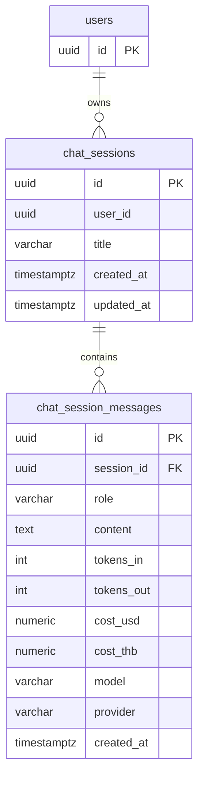

## Table Info

| Field | Value |
| :--- | :--- |
| Tables | `chat_sessions`, `chat_session_messages` |
| Engine | TimescaleDB (Postgres 16) |
| Model file | `backend/app/models/chat_session.py` |
| Primary key | UUID v4 (both tables) |

---

## Columns — `chat_sessions`

| Column | Type | Nullable | Default | Notes |
| :--- | :--- | :--- | :--- | :--- |
| `id` | UUID | NO | `uuid4()` | PK |
| `user_id` | UUID | NO | — | Indexed; FK to `users.id` (no DB-level FK, enforced in app) |
| `title` | VARCHAR(100) | NO | — | Display name; capped at 60 chars by API |
| `created_at` | TIMESTAMPTZ | NO | `now()` | — |
| `updated_at` | TIMESTAMPTZ | NO | `now()` | Updated on each new message |

## Columns — `chat_session_messages`

| Column | Type | Nullable | Default | Notes |
| :--- | :--- | :--- | :--- | :--- |
| `id` | UUID | NO | `uuid4()` | PK |
| `session_id` | UUID | NO | — | FK → `chat_sessions.id` ON DELETE CASCADE; indexed |
| `role` | VARCHAR(10) | NO | — | `user` or `assistant` |
| `content` | TEXT | NO | — | Raw message text or JSON (out-of-scope marker) |
| `tokens_in` | INTEGER | YES | NULL | Prompt tokens; null for user-role messages |
| `tokens_out` | INTEGER | YES | NULL | Completion tokens; null for user-role messages |
| `cost_usd` | NUMERIC(10,6) | YES | NULL | USD cost; null for user-role messages |
| `cost_thb` | NUMERIC(10,6) | YES | NULL | THB cost at exchange rate at call time |
| `model` | VARCHAR(100) | YES | NULL | e.g. `gpt-4o`, `claude-3-5-sonnet-20241022` |
| `provider` | VARCHAR(50) | YES | NULL | e.g. `openai`, `anthropic`, `ollama` |
| `created_at` | TIMESTAMPTZ | NO | `now()` | Indexed |

---

## Constraints & Indexes

| Name | Table | Type | Columns |
| :--- | :--- | :--- | :--- |
| PK | `chat_sessions` | PRIMARY KEY | `id` |
| idx_user | `chat_sessions` | INDEX | `user_id` |
| PK | `chat_session_messages` | PRIMARY KEY | `id` |
| fk_session | `chat_session_messages` | FK ON DELETE CASCADE | `session_id` → `chat_sessions.id` |
| idx_session | `chat_session_messages` | INDEX | `session_id` |
| idx_created | `chat_session_messages` | INDEX | `created_at` |

---

## Entity Relationships



---

## SQLAlchemy Model (reference snapshot)

```python
class ChatSession(Base):
    __tablename__ = "chat_sessions"
    id: Mapped[uuid.UUID] = mapped_column(UUID(as_uuid=True), primary_key=True, default=uuid.uuid4)
    user_id: Mapped[uuid.UUID] = mapped_column(UUID(as_uuid=True), nullable=False, index=True)
    title: Mapped[str] = mapped_column(String(100), nullable=False)
    created_at: Mapped[datetime] = mapped_column(DateTime(timezone=True), default=lambda: datetime.now(timezone.utc))
    updated_at: Mapped[datetime] = mapped_column(DateTime(timezone=True), default=lambda: datetime.now(timezone.utc))

class ChatSessionMessage(Base):
    __tablename__ = "chat_session_messages"
    id: Mapped[uuid.UUID] = mapped_column(UUID(as_uuid=True), primary_key=True, default=uuid.uuid4)
    session_id: Mapped[uuid.UUID] = mapped_column(UUID(as_uuid=True), ForeignKey("chat_sessions.id", ondelete="CASCADE"), nullable=False, index=True)
    role: Mapped[str] = mapped_column(String(10), nullable=False)
    content: Mapped[str] = mapped_column(Text, nullable=False)
    tokens_in: Mapped[Optional[int]] = mapped_column(Integer, nullable=True)
    tokens_out: Mapped[Optional[int]] = mapped_column(Integer, nullable=True)
    cost_usd: Mapped[Optional[Decimal]] = mapped_column(Numeric(10, 6), nullable=True)
    cost_thb: Mapped[Optional[Decimal]] = mapped_column(Numeric(10, 6), nullable=True)
    model: Mapped[Optional[str]] = mapped_column(String(100), nullable=True)
    provider: Mapped[Optional[str]] = mapped_column(String(50), nullable=True)
    created_at: Mapped[datetime] = mapped_column(DateTime(timezone=True), default=lambda: datetime.now(timezone.utc), index=True)
```

---

## TimescaleDB Notes

Not a hypertable. Standard Postgres tables. No compression or retention policies.

---

## Service Layer

| Layer | File | Purpose |
| :--- | :--- | :--- |
| API Router | `backend/app/api/chat.py` | Session CRUD + chat endpoint |
| LLM Gateway | `backend/app/services/llm_gateway.py` | Calls LLM and returns tokens/cost |
| Frontend service | `frontend/lib/services/chat.ts` | All API calls for sessions and messages |

---

## Related

- API - GET Chat Sessions
- API - POST Chat Session
- API - POST Chat
- Page - Chat
- DB - llm_call_logs
