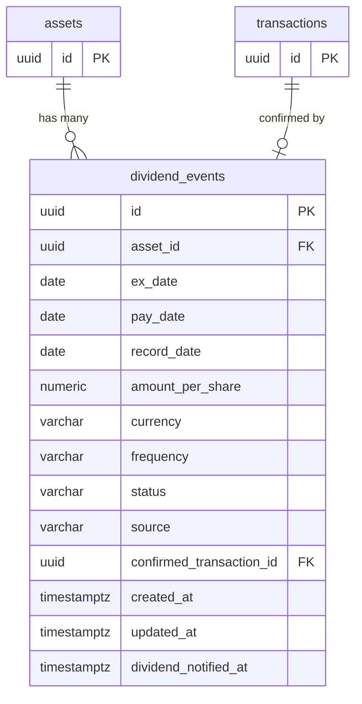

## Table Info
| Field | Value |
| :--- | :--- |
| Table | `dividend_events` |
| Engine | TimescaleDB (Postgres 16) |
| Model file | `backend/app/models/dividend_event.py` |
| Primary key | UUID (uuid4) |

## Columns
| Column | Type | Nullable | Default | Notes |
| :--- | :--- | :--- | :--- | :--- |
| `id` | UUID | No | uuid4 | Primary key |
| `asset_id` | UUID | No | — | FK → `assets.id`, indexed |
| `ex_date` | Date | No | — | Ex-dividend date |
| `pay_date` | Date | Yes | NULL | Payment date |
| `record_date` | Date | Yes | NULL | Record date |
| `amount_per_share` | Numeric(20,8) | No | — | Dividend amount per share |
| `currency` | String(10) | No | `"USD"` | Currency code |
| `frequency` | String(20) | Yes | NULL | e.g. quarterly, annual |
| `status` | Enum | No | — | `upcoming`, `payable`, `paid` |
| `source` | String(20) | No | `"yfinance"` | Data source |
| `confirmed_transaction_id` | UUID | Yes | NULL | FK → `transactions.id` |
| `created_at` | DateTime(tz) | No | utcnow | Record creation timestamp |
| `updated_at` | DateTime(tz) | No | utcnow | Last update timestamp |
| `dividend_notified_at` | DateTime(tz) | Yes | NULL | When dividend alert was sent |

## Constraints & Indexes
| Name | Type | Columns |
| :--- | :--- | :--- |
| `uq_dividend_events_asset_ex_date` | UNIQUE | `asset_id`, `ex_date` |
| `ix_dividend_events_asset_id` | INDEX | `asset_id` |
| FK to `assets` | FOREIGN KEY | `asset_id` |
| FK to `transactions` | FOREIGN KEY | `confirmed_transaction_id` |

## Entity Relationships



## SQLAlchemy Model (reference snapshot)

```python
class DividendEvent(Base):
    __tablename__ = "dividend_events"
    __table_args__ = (UniqueConstraint("asset_id", "ex_date", name="uq_dividend_events_asset_ex_date"),)

    id: Mapped[uuid.UUID] = mapped_column(UUID(as_uuid=True), primary_key=True, default=uuid.uuid4)
    asset_id: Mapped[uuid.UUID] = mapped_column(UUID(as_uuid=True), ForeignKey("assets.id"), nullable=False, index=True)
    ex_date: Mapped[date] = mapped_column(Date, nullable=False)
    pay_date: Mapped[date | None] = mapped_column(Date, nullable=True)
    record_date: Mapped[date | None] = mapped_column(Date, nullable=True)
    amount_per_share: Mapped[Decimal] = mapped_column(Numeric(20, 8), nullable=False)
    currency: Mapped[str] = mapped_column(String(10), nullable=False, default="USD")
    frequency: Mapped[str | None] = mapped_column(String(20), nullable=True)
    status: Mapped[str] = mapped_column(
        Enum(*DIVIDEND_EVENT_STATUSES, name="dividend_event_status_enum"), nullable=False
    )
    source: Mapped[str] = mapped_column(String(20), nullable=False, default="yfinance")
    confirmed_transaction_id: Mapped[uuid.UUID | None] = mapped_column(
        UUID(as_uuid=True), ForeignKey("transactions.id"), nullable=True
    )
    created_at: Mapped[datetime] = mapped_column(DateTime(timezone=True), default=lambda: datetime.now(timezone.utc))
    updated_at: Mapped[datetime] = mapped_column(DateTime(timezone=True), default=lambda: datetime.now(timezone.utc))
    dividend_notified_at: Mapped[datetime | None] = mapped_column(DateTime(timezone=True), nullable=True, default=None)
```

## TimescaleDB Notes

Standard Postgres table. Not a hypertable. Dividend events are discrete records keyed by asset + ex_date, not continuous time-series data.

## Service Layer
| Layer | File | Purpose |
| :--- | :--- | :--- |
| API | `backend/app/api/dividends.py` | REST endpoints for dividend events |
| Service | `backend/app/services/dividend_feed.py` | Fetches and upserts dividend data from yfinance |
| Service | `backend/app/services/dividend_alert.py` | Sends notifications when dividends approach |
| Schema | `backend/app/schemas/dividend.py` | Pydantic request/response models |

## Related
- DB - assets
- DB - transactions
- `backend/app/services/dividend_feed.py`
- `backend/app/services/dividend_alert.py`
- `backend/app/api/dividends.py`
