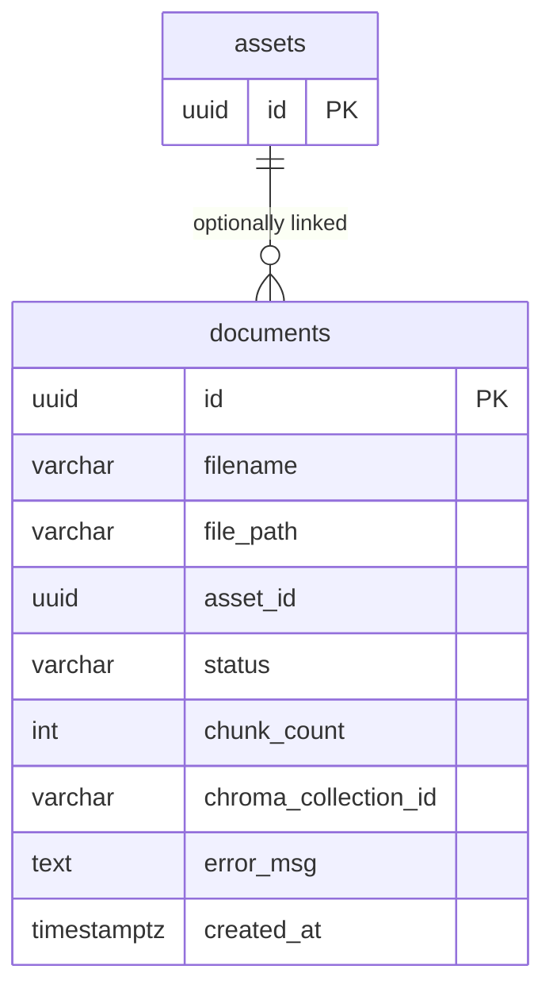

## Table Info
| Field | Value |
| :--- | :--- |
| Table | `documents` |
| Engine | TimescaleDB (Postgres 16) |
| Model file | `backend/app/models/document.py` |
| Primary key | UUID (uuid4) |

## Columns
| Column | Type | Nullable | Default | Notes |
| :--- | :--- | :--- | :--- | :--- |
| `id` | UUID | No | uuid4 | Primary key |
| `filename` | String | No | — | Original uploaded filename |
| `file_path` | String | No | — | Filesystem or object storage path |
| `asset_id` | UUID | Yes | NULL | Optional link to an asset (no FK constraint) |
| `status` | String | No | `"pending"` | Processing status: `pending`, `processing`, `done`, `failed` |
| `chunk_count` | Integer | Yes | NULL | Number of vector chunks created |
| `chroma_collection_id` | String | Yes | NULL | ChromaDB collection identifier |
| `error_msg` | Text | Yes | NULL | Error detail if status = `failed` |
| `created_at` | DateTime(tz) | No | utcnow | Upload timestamp |

> Note: `asset_id` has no FK constraint in the model — it is a soft reference to `assets.id`.

## Constraints & Indexes
| Name | Type | Columns |
| :--- | :--- | :--- |
| PK | PRIMARY KEY | `id` |

## Entity Relationships



## SQLAlchemy Model (reference snapshot)

```python
class Document(Base):
    __tablename__ = "documents"

    id: Mapped[uuid.UUID] = mapped_column(UUID(as_uuid=True), primary_key=True, default=uuid.uuid4)
    filename: Mapped[str] = mapped_column(nullable=False)
    file_path: Mapped[str] = mapped_column(nullable=False)
    asset_id: Mapped[uuid.UUID | None] = mapped_column(UUID(as_uuid=True), nullable=True)
    status: Mapped[str] = mapped_column(nullable=False, default="pending")
    chunk_count: Mapped[int | None] = mapped_column(Integer, nullable=True)
    chroma_collection_id: Mapped[str | None] = mapped_column(nullable=True)
    error_msg: Mapped[str | None] = mapped_column(Text, nullable=True)
    created_at: Mapped[datetime] = mapped_column(
        DateTime(timezone=True), default=lambda: datetime.now(timezone.utc)
    )
```

## TimescaleDB Notes

Standard Postgres table. Not a hypertable. Documents are discrete upload records. Vector data is stored in ChromaDB (external), with only the collection ID referenced here.

## Service Layer
| Layer | File | Purpose |
| :--- | :--- | :--- |
| API | `backend/app/api/documents.py` | Upload, list, and delete document records; trigger ingestion pipeline |

## Related
- `backend/app/api/documents.py`
- DB - assets
- ChromaDB vector store (external, not in Postgres)
