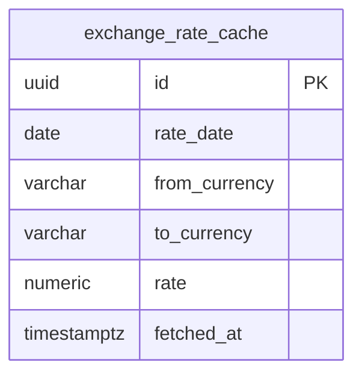

## Table Info
| Field | Value |
| :--- | :--- |
| Table | `exchange_rate_cache` |
| Engine | TimescaleDB (Postgres 16) |
| Model file | `backend/app/models/exchange_rate_cache.py` |
| Primary key | UUID (uuid4) |

## Columns
| Column | Type | Nullable | Default | Notes |
| :--- | :--- | :--- | :--- | :--- |
| `id` | UUID | No | uuid4 | Primary key |
| `rate_date` | Date | No | — | The date for this exchange rate, indexed |
| `from_currency` | String(10) | No | — | Source currency code (e.g. `USD`) |
| `to_currency` | String(10) | No | — | Target currency code (e.g. `THB`) |
| `rate` | Numeric(12,6) | No | — | Conversion rate: 1 `from_currency` = `rate` `to_currency` |
| `fetched_at` | DateTime(tz) | No | utcnow | When this rate was fetched from the external source |

## Constraints & Indexes
| Name | Type | Columns |
| :--- | :--- | :--- |
| `uq_exchange_rate_cache_rate_date_from_to` | UNIQUE | `rate_date`, `from_currency`, `to_currency` |
| `ix_exchange_rate_cache_rate_date` | INDEX | `rate_date` |

## Entity Relationships



## SQLAlchemy Model (reference snapshot)

```python
class ExchangeRateCache(Base):
    __tablename__ = "exchange_rate_cache"
    __table_args__ = (UniqueConstraint("rate_date", "from_currency", "to_currency"),)

    id: Mapped[uuid.UUID] = mapped_column(UUID(as_uuid=True), primary_key=True, default=uuid.uuid4)
    rate_date: Mapped[date] = mapped_column(Date, nullable=False, index=True)
    from_currency: Mapped[str] = mapped_column(String(10), nullable=False)
    to_currency: Mapped[str] = mapped_column(String(10), nullable=False)
    rate: Mapped[Decimal] = mapped_column(Numeric(12, 6), nullable=False)
    fetched_at: Mapped[datetime] = mapped_column(
        DateTime(timezone=True), default=lambda: datetime.now(timezone.utc)
    )
```

## TimescaleDB Notes

Standard Postgres table. Not a hypertable. While rates are date-keyed, this is a cache/lookup table — not a continuous time-series requiring TimescaleDB chunk partitioning or compression. Queries are point lookups by `(rate_date, from_currency, to_currency)`.

## Service Layer
| Layer | File | Purpose |
| :--- | :--- | :--- |
| Service | `backend/app/services/exchange_rate.py` | Fetches rates from external API and upserts into cache; resolves rates for portfolio value conversion |

## Related
- `backend/app/services/exchange_rate.py`
- DB - assets
- DB - net_worth_snapshots (uses exchange rates for multi-currency valuation)
