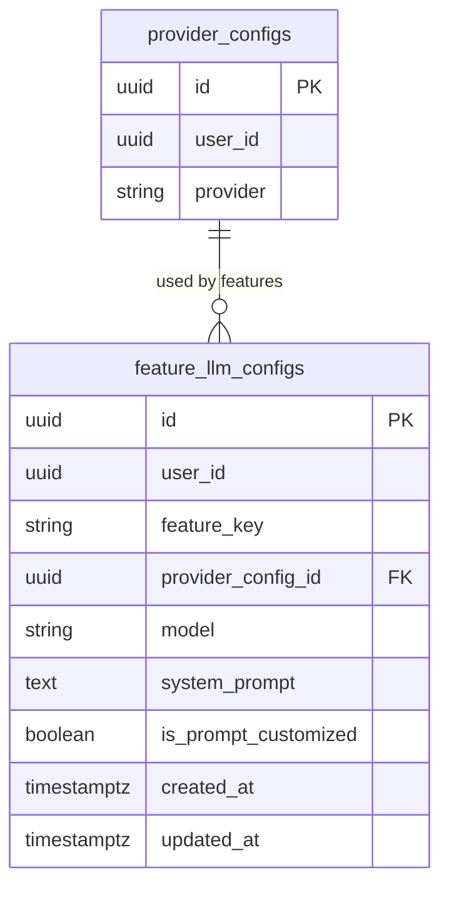

## Table Info
| Field | Value |
| :--- | :--- |
| Table | `feature_llm_configs` |
| Engine | TimescaleDB (Postgres 16) |
| Model file | `backend/app/models/feature_llm_config.py` |
| Primary key | UUID (`id`) |
| Purpose | Per-user, per-feature LLM configuration — binds a feature key (e.g. `portfolio_analysis`) to a specific provider config and model, with an optional custom system prompt |

## Columns
| Column | Type | Nullable | Default | Notes |
| :--- | :--- | :--- | :--- | :--- |
| `id` | UUID | NO | `uuid.uuid4()` | Primary key |
| `user_id` | UUID | NO | — | Owning user (no FK constraint); indexed |
| `feature_key` | VARCHAR(60) | NO | — | One of 7 defined feature keys (see below) |
| `provider_config_id` | UUID | NO | — | FK → `provider_configs.id` |
| `model` | VARCHAR(100) | NO | — | Model identifier to use for this feature |
| `system_prompt` | TEXT | NO | — | System prompt (default or customized) |
| `is_prompt_customized` | BOOLEAN | NO | `false` | True if user has overridden the default prompt |
| `created_at` | TIMESTAMPTZ | NO | `now()` | Record creation time |
| `updated_at` | TIMESTAMPTZ | NO | `now()` | Last update time (auto-updated via `onupdate`) |

### Valid `feature_key` Values
| Key | Description |
| :--- | :--- |
| `import_translator` | CSV/broker import translation |
| `portfolio_analysis` | Portfolio asset analysis |
| `overview_analysis` | Portfolio-level overview |
| `chat` | In-app chat assistant |
| `watchlist_scan` | Watchlist scanning |
| `watchlist_discovery` | Watchlist discovery suggestions |
| `ipo_analysis` | IPO event analysis |

## Constraints & Indexes
| Name | Type | Columns |
| :--- | :--- | :--- |
| `feature_llm_configs_pkey` | PRIMARY KEY | `id` |
| `feature_llm_configs_provider_config_id_fkey` | FOREIGN KEY | `provider_config_id` → `provider_configs.id` |
| `ix_feature_llm_configs_user_id` | INDEX | `user_id` |

## Entity Relationships


## SQLAlchemy Model (reference snapshot)
```python
FEATURE_KEYS = (
    "import_translator",
    "portfolio_analysis",
    "overview_analysis",
    "chat",
    "watchlist_scan",
    "watchlist_discovery",
    "ipo_analysis",
)

class FeatureLLMConfig(Base):
    __tablename__ = "feature_llm_configs"

    id: Mapped[uuid.UUID] = mapped_column(UUID(as_uuid=True), primary_key=True, default=uuid.uuid4)
    user_id: Mapped[uuid.UUID] = mapped_column(UUID(as_uuid=True), nullable=False, index=True)
    feature_key: Mapped[str] = mapped_column(String(60), nullable=False)
    provider_config_id: Mapped[uuid.UUID] = mapped_column(
        UUID(as_uuid=True), ForeignKey("provider_configs.id"), nullable=False
    )
    model: Mapped[str] = mapped_column(String(100), nullable=False)
    system_prompt: Mapped[str] = mapped_column(Text, nullable=False)
    is_prompt_customized: Mapped[bool] = mapped_column(Boolean, default=False)
    created_at: Mapped[datetime] = mapped_column(
        DateTime(timezone=True), default=lambda: datetime.now(timezone.utc)
    )
    updated_at: Mapped[datetime] = mapped_column(
        DateTime(timezone=True), default=lambda: datetime.now(timezone.utc),
        onupdate=lambda: datetime.now(timezone.utc)
    )
```

## TimescaleDB Notes
Standard Postgres table. Not a hypertable. Expected to have at most 7 rows per user (one per feature key).

## Service Layer
| Layer | File | Purpose |
| :--- | :--- | :--- |
| API | `backend/app/api/feature_llm_config.py` | CRUD for feature configs |
| API | `backend/app/api/watchlist.py` | Reads config for watchlist features |
| Service | `backend/app/services/llm_gateway.py` | Resolves feature config before dispatching LLM |
| Service | `backend/app/services/system_backup.py` | Includes in backup/restore |

## Related
- DB - provider_configs
- DB - llm_settings
- DB - ai_analyses
- DB - overview_analyses
