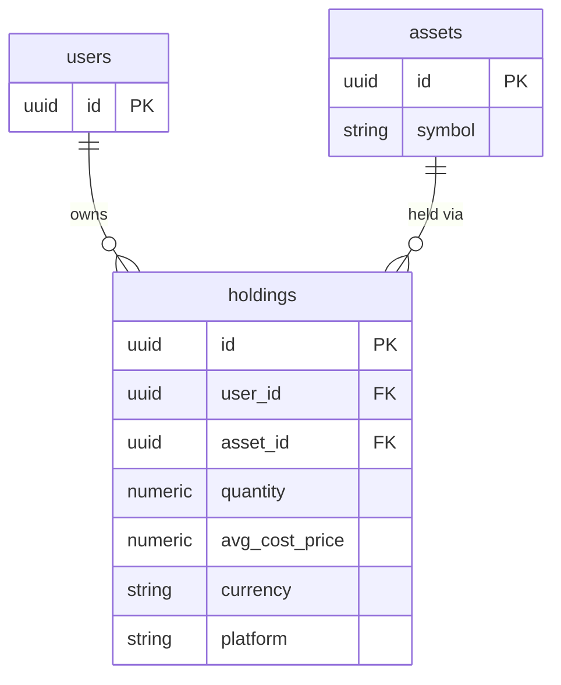

## Table Info
| Field | Value |
| :--- | :--- |
| Table | `holdings` |
| Engine | TimescaleDB (Postgres 16) |
| Model file | `backend/app/models/holding.py` |
| Primary key | UUID (auto-generated via `uuid.uuid4`) |

## Columns
| Column | Type | Nullable | Default | Notes |
| :--- | :--- | :--- | :--- | :--- |
| `id` | UUID | No | `uuid.uuid4()` | Primary key |
| `user_id` | UUID | No | — | FK → `users.id`, indexed |
| `asset_id` | UUID | No | — | FK → `assets.id` |
| `quantity` | Numeric(20, 8) | No | — | Number of units held |
| `avg_cost_price` | Numeric(20, 8) | No | — | Weighted average cost per unit |
| `currency` | String(10) | No | `"THB"` | Currency of the cost basis |
| `purchased_at` | Date | Yes | `None` | Date of initial purchase (informational) |
| `updated_at` | DateTime(tz) | No | `datetime.now(utc)` | Last record modification time |
| `platform` | String(100) | Yes | `None` | Broker/platform name, e.g. `"Bitkub"` |

## Constraints & Indexes
| Name | Type | Columns |
| :--- | :--- | :--- |
| `pk_holdings` | PRIMARY KEY | `id` |
| `fk_holdings_user_id` | FOREIGN KEY | `user_id` → `users.id` |
| `fk_holdings_asset_id` | FOREIGN KEY | `asset_id` → `assets.id` |
| `ix_holdings_user_id` | INDEX | `user_id` |

## Entity Relationships


## SQLAlchemy Model (reference snapshot)
```python
class Holding(Base):
    __tablename__ = "holdings"

    id: Mapped[uuid.UUID] = mapped_column(UUID(as_uuid=True), primary_key=True, default=uuid.uuid4)
    user_id: Mapped[uuid.UUID] = mapped_column(UUID(as_uuid=True), ForeignKey("users.id"), nullable=False, index=True)
    asset_id: Mapped[uuid.UUID] = mapped_column(UUID(as_uuid=True), ForeignKey("assets.id"), nullable=False)
    quantity: Mapped[Decimal] = mapped_column(Numeric(20, 8), nullable=False)
    avg_cost_price: Mapped[Decimal] = mapped_column(Numeric(20, 8), nullable=False)
    currency: Mapped[str] = mapped_column(String(10), nullable=False, default="THB")
    purchased_at: Mapped[date | None] = mapped_column(Date(), nullable=True)
    updated_at: Mapped[datetime] = mapped_column(
        DateTime(timezone=True), default=lambda: datetime.now(timezone.utc)
    )
    platform: Mapped[str | None] = mapped_column(String(100), nullable=True)
```

## TimescaleDB Notes
Standard Postgres table. Not a hypertable. `updated_at` is application-managed, not a TimescaleDB feature. For point-in-time portfolio snapshots, see the `net_worth_snapshot` service.

## Service Layer
| Layer | File | Purpose |
| :--- | :--- | :--- |
| Service | `app/services/portfolio.py` | Reads/writes holdings for portfolio view |
| Service | `app/services/overview.py` | Aggregates holdings for dashboard |
| Service | `app/services/overview_analysis.py` | AI-driven portfolio analysis |
| Service | `app/services/net_worth_snapshot.py` | Uses holdings to compute net worth |
| Service | `app/services/chat_tools.py` | AI chat: current holdings context |
| Service | `app/services/dividend_alert.py` | Checks holding quantity for dividend eligibility |
| Service | `app/services/dividend_feed.py` | Enriches holdings with dividend data |
| Service | `app/services/system_backup.py` | Exports holding records |
| API Router | `app/api/dividends.py` | Dividend-related holding queries |
| API Router | `app/api/import_pipeline.py` | Bulk holding import |

## Related
- DB - users
- DB - assets
- DB - transactions
