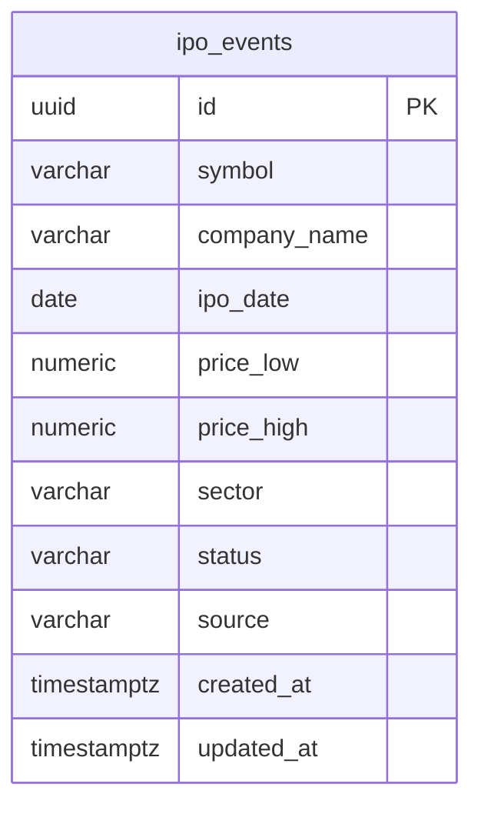

## Table Info
| Field | Value |
| :--- | :--- |
| Table | `ipo_events` |
| Engine | TimescaleDB (Postgres 16) |
| Model file | `backend/app/models/ipo_event.py` |
| Primary key | UUID (uuid4) |

## Columns
| Column | Type | Nullable | Default | Notes |
| :--- | :--- | :--- | :--- | :--- |
| `id` | UUID | No | uuid4 | Primary key |
| `symbol` | String(20) | No | — | Ticker symbol, indexed |
| `company_name` | String(200) | Yes | NULL | Full company name |
| `ipo_date` | Date | No | — | IPO listing date |
| `price_low` | Numeric(20,8) | Yes | NULL | Lower bound of price range |
| `price_high` | Numeric(20,8) | Yes | NULL | Upper bound of price range |
| `sector` | String(100) | Yes | NULL | Industry sector |
| `status` | Enum | No | `"upcoming"` | `upcoming`, `priced`, `listed` |
| `source` | String(20) | No | `"yfinance"` | Data source |
| `created_at` | DateTime(tz) | No | utcnow | Record creation timestamp |
| `updated_at` | DateTime(tz) | No | utcnow | Last update (auto on update) |

## Constraints & Indexes
| Name | Type | Columns |
| :--- | :--- | :--- |
| `uq_ipo_events_symbol_date` | UNIQUE | `symbol`, `ipo_date` |
| `ix_ipo_events_symbol` | INDEX | `symbol` |

## Entity Relationships



## SQLAlchemy Model (reference snapshot)

```python
class IpoEvent(Base):
    __tablename__ = "ipo_events"
    __table_args__ = (UniqueConstraint("symbol", "ipo_date", name="uq_ipo_events_symbol_date"),)

    id: Mapped[uuid.UUID] = mapped_column(UUID(as_uuid=True), primary_key=True, default=uuid.uuid4)
    symbol: Mapped[str] = mapped_column(String(20), nullable=False, index=True)
    company_name: Mapped[str | None] = mapped_column(String(200), nullable=True)
    ipo_date: Mapped[date] = mapped_column(Date, nullable=False)
    price_low: Mapped[Decimal | None] = mapped_column(Numeric(20, 8), nullable=True)
    price_high: Mapped[Decimal | None] = mapped_column(Numeric(20, 8), nullable=True)
    sector: Mapped[str | None] = mapped_column(String(100), nullable=True)
    status: Mapped[str] = mapped_column(
        Enum(*IPO_EVENT_STATUSES, name="ipo_event_status_enum"), nullable=False, default="upcoming"
    )
    source: Mapped[str] = mapped_column(String(20), nullable=False, default="yfinance")
    created_at: Mapped[datetime] = mapped_column(DateTime(timezone=True), default=lambda: datetime.now(timezone.utc))
    updated_at: Mapped[datetime] = mapped_column(
        DateTime(timezone=True), default=lambda: datetime.now(timezone.utc),
        onupdate=lambda: datetime.now(timezone.utc)
    )
```

## TimescaleDB Notes

Standard Postgres table. Not a hypertable. IPO events are keyed by symbol + date — not continuous time-series data. No TimescaleDB-specific features are used.

## Service Layer
| Layer | File | Purpose |
| :--- | :--- | :--- |
| Service | `backend/app/services/ipo_feed.py` | Fetches and upserts IPO calendar data |
| Schema | `backend/app/schemas/ipo.py` | Pydantic request/response models |
| Alembic | `backend/alembic/env.py` | Migration environment includes this model |

## Related
- `backend/app/services/ipo_feed.py`
- `backend/app/schemas/ipo.py`
- DB - assets
