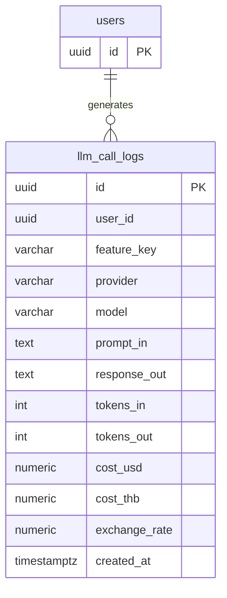

## Table Info

| Field | Value |
| :--- | :--- |
| Table | `llm_call_logs` |
| Engine | TimescaleDB (Postgres 16) |
| Model file | `backend/app/models/llm_call_log.py` |
| Primary key | UUID v4 |
| Purpose | Audit log for every LLM API call made by any feature in Zentri |

---

## Columns

| Column | Type | Nullable | Default | Notes |
| :--- | :--- | :--- | :--- | :--- |
| `id` | UUID | NO | `uuid4()` | PK |
| `user_id` | UUID | NO | — | Indexed; identifies which user triggered the call |
| `feature_key` | VARCHAR(50) | NO | — | Indexed; e.g. `overview_analysis`, `chat`, `watchlist_alert` |
| `provider` | VARCHAR(30) | NO | — | e.g. `openai`, `anthropic`, `ollama` |
| `model` | VARCHAR(100) | NO | — | e.g. `gpt-4o`, `claude-3-5-sonnet-20241022` |
| `prompt_in` | TEXT | NO | — | Full prompt sent to the LLM (may be large) |
| `response_out` | TEXT | NO | — | Full response from the LLM |
| `tokens_in` | INTEGER | NO | `0` | Prompt token count |
| `tokens_out` | INTEGER | NO | `0` | Completion token count |
| `cost_usd` | NUMERIC(10,6) | NO | `0` | USD cost at time of call |
| `cost_thb` | NUMERIC(10,6) | NO | `0` | THB cost using `exchange_rate` |
| `exchange_rate` | NUMERIC(10,4) | NO | `0` | USD/THB rate applied at call time |
| `created_at` | TIMESTAMPTZ | NO | `now()` | Indexed |

---

## Constraints & Indexes

| Name | Type | Columns |
| :--- | :--- | :--- |
| PK | PRIMARY KEY | `id` |
| idx_user | INDEX | `user_id` |
| idx_feature | INDEX | `feature_key` |
| idx_created | INDEX | `created_at` |

---

## Entity Relationships



---

## SQLAlchemy Model (reference snapshot)

```python
class LLMCallLog(Base):
    __tablename__ = "llm_call_logs"
    id: Mapped[uuid.UUID] = mapped_column(UUID(as_uuid=True), primary_key=True, default=uuid.uuid4)
    user_id: Mapped[uuid.UUID] = mapped_column(UUID(as_uuid=True), nullable=False, index=True)
    feature_key: Mapped[str] = mapped_column(String(50), nullable=False, index=True)
    provider: Mapped[str] = mapped_column(String(30), nullable=False)
    model: Mapped[str] = mapped_column(String(100), nullable=False)
    prompt_in: Mapped[str] = mapped_column(Text, nullable=False)
    response_out: Mapped[str] = mapped_column(Text, nullable=False)
    tokens_in: Mapped[int] = mapped_column(Integer, default=0)
    tokens_out: Mapped[int] = mapped_column(Integer, default=0)
    cost_usd: Mapped[Decimal] = mapped_column(Numeric(10, 6), default=0)
    cost_thb: Mapped[Decimal] = mapped_column(Numeric(10, 6), default=0)
    exchange_rate: Mapped[Decimal] = mapped_column(Numeric(10, 4), default=0)
    created_at: Mapped[datetime] = mapped_column(DateTime(timezone=True), default=lambda: datetime.now(timezone.utc), index=True)
```

---

## TimescaleDB Notes

Not a hypertable. Standard Postgres table. If call volume grows, consider converting `created_at` to a hypertable partition key and enabling compression.

---

## Service Layer

| Layer | File | Purpose |
| :--- | :--- | :--- |
| LLM Gateway | `backend/app/services/llm_gateway.py` | Writes a row after every LLM call |
| API Router | `backend/app/api/llm_usage.py` | Reads rows for the AI Usage page |
| Frontend | `frontend/app/(auth)/ai-usage/page.tsx` | Displays logs table + payload viewer |

---

## Related

- API - GET LLM Call Logs
- API - GET LLM Call Log Detail
- Page - AI Usage
- DB - chat_sessions
