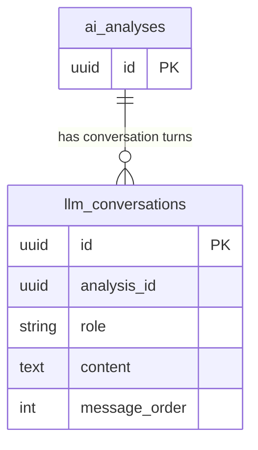

## Table Info
| Field | Value |
| :--- | :--- |
| Table | `llm_conversations` |
| Engine | TimescaleDB (Postgres 16) |
| Model file | `backend/app/models/llm_conversation.py` |
| Primary key | UUID (`id`) |
| Purpose | Stores individual messages (turns) in an LLM conversation linked to an analysis record, ordered by `message_order` |

## Columns
| Column | Type | Nullable | Default | Notes |
| :--- | :--- | :--- | :--- | :--- |
| `id` | UUID | NO | `uuid.uuid4()` | Primary key |
| `analysis_id` | UUID | NO | — | Soft reference to an analysis record (no FK constraint) |
| `role` | VARCHAR | NO | — | Message role: `user`, `assistant`, or `system` |
| `content` | TEXT | NO | — | Full message content |
| `message_order` | INTEGER | NO | — | Sequential position of this message in the conversation |

## Constraints & Indexes
| Name | Type | Columns |
| :--- | :--- | :--- |
| `llm_conversations_pkey` | PRIMARY KEY | `id` |

## Entity Relationships


## SQLAlchemy Model (reference snapshot)
```python
class LLMConversation(Base):
    __tablename__ = "llm_conversations"

    id: Mapped[uuid.UUID] = mapped_column(UUID(as_uuid=True), primary_key=True, default=uuid.uuid4)
    analysis_id: Mapped[uuid.UUID] = mapped_column(UUID(as_uuid=True), nullable=False)
    role: Mapped[str] = mapped_column(nullable=False)
    content: Mapped[str] = mapped_column(Text, nullable=False)
    message_order: Mapped[int] = mapped_column(Integer, nullable=False)
```

## TimescaleDB Notes
Standard Postgres table. Not a hypertable. Records are append-only; conversations are reconstructed by ordering on `message_order`.

## Service Layer
| Layer | File | Purpose |
| :--- | :--- | :--- |
| API | `backend/app/api/analysis.py` | Reads conversation turns for an analysis |
| Service | `backend/app/services/system_backup.py` | Includes in backup/restore |
| Worker | `backend/worker/jobs/run_analysis.py` | Writes conversation turns after LLM call |

## Related
- DB - ai_analyses
- DB - overview_analyses
