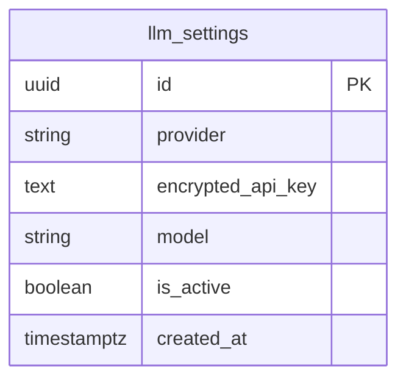

## Table Info
| Field | Value |
| :--- | :--- |
| Table | `llm_settings` |
| Engine | TimescaleDB (Postgres 16) |
| Model file | `backend/app/models/llm_settings.py` |
| Primary key | UUID (`id`) |
| Purpose | Stores global (platform-level) LLM provider settings with encrypted API keys; only one record should be active at a time |

## Columns
| Column | Type | Nullable | Default | Notes |
| :--- | :--- | :--- | :--- | :--- |
| `id` | UUID | NO | `uuid.uuid4()` | Primary key |
| `provider` | VARCHAR | NO | — | LLM provider name (e.g. openai, anthropic) |
| `encrypted_api_key` | TEXT | YES | — | Fernet-encrypted API key; NULL for local providers |
| `model` | VARCHAR | NO | — | Default model identifier for this provider |
| `is_active` | BOOLEAN | NO | `false` | Whether this config is the active global setting |
| `created_at` | TIMESTAMPTZ | NO | `now()` | Record creation time |

## Constraints & Indexes
| Name | Type | Columns |
| :--- | :--- | :--- |
| `llm_settings_pkey` | PRIMARY KEY | `id` |

## Entity Relationships


## SQLAlchemy Model (reference snapshot)
```python
class LLMSettings(Base):
    __tablename__ = "llm_settings"

    id: Mapped[uuid.UUID] = mapped_column(UUID(as_uuid=True), primary_key=True, default=uuid.uuid4)
    provider: Mapped[str] = mapped_column(nullable=False)
    encrypted_api_key: Mapped[str | None] = mapped_column(Text, nullable=True)
    model: Mapped[str] = mapped_column(nullable=False)
    is_active: Mapped[bool] = mapped_column(Boolean, default=False)
    created_at: Mapped[datetime] = mapped_column(
        DateTime(timezone=True), default=lambda: datetime.now(timezone.utc)
    )
```

## TimescaleDB Notes
Standard Postgres table. Not a hypertable. This is a low-write, low-row-count config table.

## Service Layer
| Layer | File | Purpose |
| :--- | :--- | :--- |
| API | `backend/app/api/settings.py` | CRUD for LLM settings |
| Service | `backend/app/services/llm_service.py` | Reads active config to dispatch LLM calls |

## Related
- DB - provider_configs
- DB - feature_llm_configs
