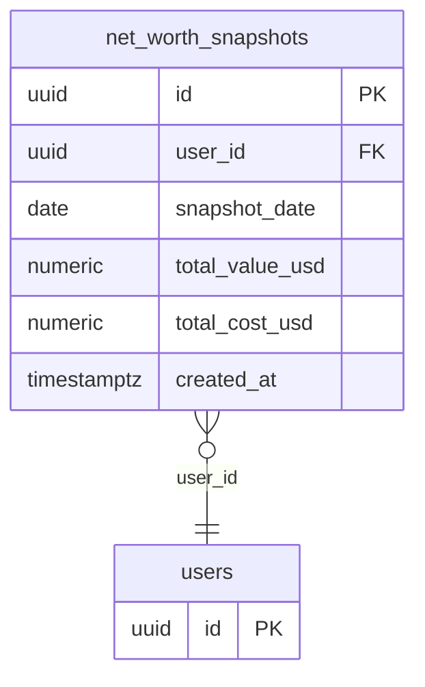

## Table Info
| Field | Value |
| :--- | :--- |
| Table | `net_worth_snapshots` |
| Engine | TimescaleDB (Postgres 16) |
| Model file | `backend/app/models/net_worth_snapshot.py` |
| Primary key | UUID (`id`) |

## Columns
| Column | Type | Nullable | Default | Notes |
| :--- | :--- | :--- | :--- | :--- |
| `id` | UUID | No | `uuid.uuid4` | Primary key |
| `user_id` | UUID | No | — | FK → `users.id`, indexed |
| `snapshot_date` | Date | No | — | Date of the net worth calculation |
| `total_value_usd` | Numeric(20,8) | No | — | Current market value of all holdings |
| `total_cost_usd` | Numeric(20,8) | No | — | Total cost basis of all holdings |
| `created_at` | DateTime(tz) | No | `datetime.now(UTC)` | Record creation timestamp |

## Constraints & Indexes
| Name | Type | Columns |
| :--- | :--- | :--- |
| `net_worth_snapshots_pkey` | Primary Key | `id` |
| `uq_net_worth_snapshots_user_date` | Unique Constraint | `user_id`, `snapshot_date` |
| `ix_net_worth_snapshots_user_id` | Index | `user_id` |
| FK on `user_id` | Foreign Key | `user_id` → `users.id` |

## Entity Relationships


## SQLAlchemy Model (reference snapshot)
```python
class NetWorthSnapshot(Base):
    __tablename__ = "net_worth_snapshots"
    __table_args__ = (UniqueConstraint("user_id", "snapshot_date", name="uq_net_worth_snapshots_user_date"),)

    id: Mapped[uuid.UUID] = mapped_column(UUID(as_uuid=True), primary_key=True, default=uuid.uuid4)
    user_id: Mapped[uuid.UUID] = mapped_column(UUID(as_uuid=True), ForeignKey("users.id"), nullable=False, index=True)
    snapshot_date: Mapped[date] = mapped_column(Date, nullable=False)
    total_value_usd: Mapped[Decimal] = mapped_column(Numeric(20, 8), nullable=False)
    total_cost_usd: Mapped[Decimal] = mapped_column(Numeric(20, 8), nullable=False)
    created_at: Mapped[datetime] = mapped_column(
        DateTime(timezone=True), default=lambda: datetime.now(timezone.utc)
    )
```

## TimescaleDB Notes
- Not configured as a hypertable.
- The `(user_id, snapshot_date)` unique constraint ensures idempotent upserts — the worker job can safely re-run without creating duplicate snapshots.
- Could benefit from a hypertable on `snapshot_date` if the table grows large and time-range queries dominate.

## Service Layer
| Layer | File | Purpose |
| :--- | :--- | :--- |
| Service | `backend/app/services/net_worth_snapshot.py` | Computes and persists daily net worth snapshots |
| Service | `backend/app/services/overview.py` | Reads snapshots for portfolio overview display |
| Worker Job | `backend/worker/jobs/net_worth_snapshot.py` | Scheduled job that triggers snapshot calculation |

## Related
- DB - cash_balances
- DB - users
- DB - assets
