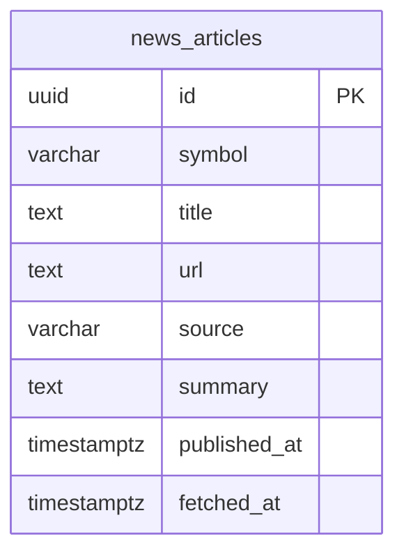

## Table Info
| Field | Value |
| :--- | :--- |
| Table | `news_articles` |
| Engine | TimescaleDB (Postgres 16) |
| Model file | `backend/app/models/news_article.py` |
| Primary key | UUID (uuid4) |

## Columns
| Column | Type | Nullable | Default | Notes |
| :--- | :--- | :--- | :--- | :--- |
| `id` | UUID | No | uuid4 | Primary key |
| `symbol` | String(20) | Yes | NULL | Ticker symbol, indexed |
| `title` | Text | No | — | Article headline |
| `url` | Text | No | — | Source URL (unique) |
| `source` | String(100) | Yes | NULL | Publisher name |
| `summary` | Text | Yes | NULL | Article summary or excerpt |
| `published_at` | DateTime(tz) | Yes | NULL | Original publication time |
| `fetched_at` | DateTime(tz) | No | utcnow | When Zentri fetched the article, indexed |

## Constraints & Indexes
| Name | Type | Columns |
| :--- | :--- | :--- |
| `url` | UNIQUE | `url` |
| `ix_news_articles_symbol` | INDEX | `symbol` |
| `ix_news_articles_fetched_at` | INDEX | `fetched_at` |
| `ix_news_articles_symbol_fetched` | COMPOSITE INDEX | `symbol`, `fetched_at` |

## Entity Relationships



## SQLAlchemy Model (reference snapshot)

```python
class NewsArticle(Base):
    __tablename__ = "news_articles"

    id: Mapped[uuid.UUID] = mapped_column(UUID(as_uuid=True), primary_key=True, default=uuid.uuid4)
    symbol: Mapped[str | None] = mapped_column(String(20), nullable=True, index=True)
    title: Mapped[str] = mapped_column(Text, nullable=False)
    url: Mapped[str] = mapped_column(Text, nullable=False, unique=True)
    source: Mapped[str | None] = mapped_column(String(100), nullable=True)
    summary: Mapped[str | None] = mapped_column(Text, nullable=True)
    published_at: Mapped[datetime | None] = mapped_column(DateTime(timezone=True), nullable=True)
    fetched_at: Mapped[datetime] = mapped_column(
        DateTime(timezone=True), default=lambda: datetime.now(timezone.utc), index=True
    )

    __table_args__ = (
        Index("ix_news_articles_symbol_fetched", "symbol", "fetched_at"),
    )
```

## TimescaleDB Notes

Standard Postgres table. Not a hypertable. While `fetched_at` is time-ordered, news articles are stored as individual records and not queried as a continuous time-series stream requiring TimescaleDB compression or chunk partitioning.

## Service Layer
| Layer | File | Purpose |
| :--- | :--- | :--- |
| Service | `backend/app/services/news_rag.py` | Fetches news articles and indexes them for RAG (retrieval-augmented generation) |

## Related
- `backend/app/services/news_rag.py`
- DB - assets
