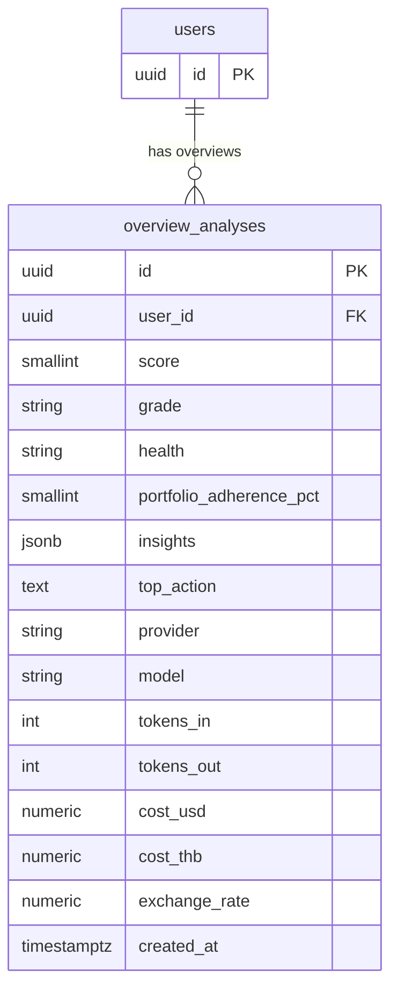

## Table Info
| Field | Value |
| :--- | :--- |
| Table | `overview_analyses` |
| Engine | TimescaleDB (Postgres 16) |
| Model file | `backend/app/models/overview_analysis.py` |
| Primary key | UUID (`id`) |
| Purpose | Stores portfolio-level AI overview results per user, including a health score, grade, insights array, and full token/cost accounting in both USD and THB |

## Columns
| Column | Type | Nullable | Default | Notes |
| :--- | :--- | :--- | :--- | :--- |
| `id` | UUID | NO | `uuid.uuid4()` | Primary key |
| `user_id` | UUID | NO | — | FK → `users.id` CASCADE DELETE; indexed |
| `score` | SMALLINT | NO | — | Portfolio health score (numeric) |
| `grade` | VARCHAR | NO | — | Letter grade (e.g. A, B+) |
| `health` | VARCHAR | NO | — | Health label (e.g. Excellent, Fair) |
| `portfolio_adherence_pct` | SMALLINT | YES | — | % adherence to user's target allocation |
| `insights` | JSONB | NO | `[]` | Array of insight objects from LLM |
| `top_action` | TEXT | NO | — | Most important recommended action |
| `provider` | VARCHAR | NO | — | LLM provider used |
| `model` | VARCHAR | NO | — | Model identifier used |
| `tokens_in` | INTEGER | NO | `0` | Input tokens consumed |
| `tokens_out` | INTEGER | NO | `0` | Output tokens consumed |
| `cost_usd` | NUMERIC(10,6) | NO | `0` | Cost in USD |
| `cost_thb` | NUMERIC(10,4) | NO | `0` | Cost converted to THB |
| `exchange_rate` | NUMERIC(12,4) | NO | `0` | USD/THB rate at time of analysis |
| `created_at` | TIMESTAMPTZ | NO | `now()` | Record creation time |

## Constraints & Indexes
| Name | Type | Columns |
| :--- | :--- | :--- |
| `overview_analyses_pkey` | PRIMARY KEY | `id` |
| `overview_analyses_user_id_fkey` | FOREIGN KEY | `user_id` → `users.id` ON DELETE CASCADE |
| `ix_overview_analyses_user_id` | INDEX | `user_id` |

## Entity Relationships


## SQLAlchemy Model (reference snapshot)
```python
class OverviewAnalysis(Base):
    __tablename__ = "overview_analyses"

    id: Mapped[uuid.UUID] = mapped_column(UUID(as_uuid=True), primary_key=True, default=uuid.uuid4)
    user_id: Mapped[uuid.UUID] = mapped_column(
        UUID(as_uuid=True), ForeignKey("users.id", ondelete="CASCADE"), nullable=False, index=True
    )
    score: Mapped[int] = mapped_column(SmallInteger, nullable=False)
    grade: Mapped[str] = mapped_column(nullable=False)
    health: Mapped[str] = mapped_column(nullable=False)
    portfolio_adherence_pct: Mapped[int | None] = mapped_column(SmallInteger, nullable=True)
    insights: Mapped[list] = mapped_column(JSONB, nullable=False, default=list)
    top_action: Mapped[str] = mapped_column(Text, nullable=False)
    provider: Mapped[str] = mapped_column(nullable=False)
    model: Mapped[str] = mapped_column(nullable=False)
    tokens_in: Mapped[int] = mapped_column(Integer, default=0)
    tokens_out: Mapped[int] = mapped_column(Integer, default=0)
    cost_usd: Mapped[Decimal] = mapped_column(Numeric(10, 6), default=0)
    cost_thb: Mapped[Decimal] = mapped_column(Numeric(10, 4), default=0)
    exchange_rate: Mapped[Decimal] = mapped_column(Numeric(12, 4), default=0)
    created_at: Mapped[datetime] = mapped_column(
        DateTime(timezone=True), default=lambda: datetime.now(timezone.utc)
    )
```

## TimescaleDB Notes
Standard Postgres table. Not a hypertable. Each overview is an immutable snapshot appended on each analysis run.

## Service Layer
| Layer | File | Purpose |
| :--- | :--- | :--- |
| Service | `backend/app/services/overview_analysis.py` | Creates overview records, queries history |

## Related
- DB - ai_analyses
- DB - provider_configs
- DB - feature_llm_configs
