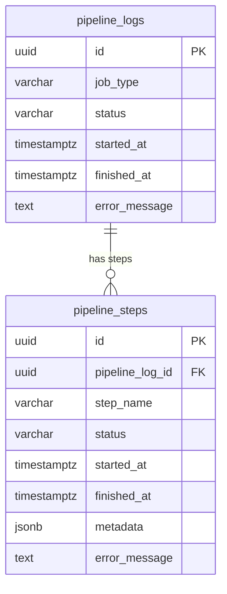

## Table Info
| Field | Value |
| :--- | :--- |
| Table | `pipeline_logs` |
| Engine | TimescaleDB (Postgres 16) |
| Model file | `backend/app/models/pipeline_log.py` |
| Primary key | UUID (uuid4) |

## Columns
| Column | Type | Nullable | Default | Notes |
| :--- | :--- | :--- | :--- | :--- |
| `id` | UUID | No | uuid4 | Primary key |
| `job_type` | Enum | No | — | One of 15 defined job types (see below) |
| `status` | Enum | No | `"queued"` | `queued`, `running`, `done`, `failed` |
| `started_at` | DateTime(tz) | No | utcnow | When job started |
| `finished_at` | DateTime(tz) | Yes | NULL | When job completed or failed |
| `error_message` | Text | Yes | NULL | Error detail if status = `failed` |

**Valid `job_type` values:**
`price_fetch_us`, `price_fetch_crypto`, `price_fetch_gold`, `price_fetch_benchmark`, `price_fetch_thai_stock`, `price_fetch_th_fund`, `snapshot_net_worth`, `backfill_historical_prices`, `ingest_document`, `run_analysis`, `watchlist_discovery`, `watchlist_scan`, `dividend_fetch`, `ipo_fetch`, `dividend_alert`

## Constraints & Indexes
| Name | Type | Columns |
| :--- | :--- | :--- |
| PK | PRIMARY KEY | `id` |

## Entity Relationships



## SQLAlchemy Model (reference snapshot)

```python
class PipelineLog(Base):
    __tablename__ = "pipeline_logs"

    id: Mapped[uuid.UUID] = mapped_column(UUID(as_uuid=True), primary_key=True, default=uuid.uuid4)
    job_type: Mapped[str] = mapped_column(Enum(*JOB_TYPES, name="job_type_enum"), nullable=False)
    status: Mapped[str] = mapped_column(
        Enum(*JOB_STATUSES, name="job_status_enum"), nullable=False, default="queued"
    )
    started_at: Mapped[datetime] = mapped_column(DateTime(timezone=True), default=lambda: datetime.now(timezone.utc))
    finished_at: Mapped[datetime | None] = mapped_column(DateTime(timezone=True), nullable=True)
    error_message: Mapped[str | None] = mapped_column(Text, nullable=True)

    steps: Mapped[list["PipelineStep"]] = relationship(
        "PipelineStep",
        back_populates="pipeline_log",
        order_by="PipelineStep.started_at",
        lazy="raise",
    )
```

## TimescaleDB Notes

Standard Postgres table. Not a hypertable. Pipeline logs are discrete job records, not continuous time-series. Duration analysis (finished_at - started_at) can be done with standard SQL.

## Service Layer
| Layer | File | Purpose |
| :--- | :--- | :--- |
| Service | `backend/app/services/pipeline.py` | Creates log entries, updates status, manages job lifecycle |
| Service | `backend/app/services/price_schedule_config.py` | References job types when scheduling price fetch jobs |
| API | `backend/app/api/pipeline.py` | REST endpoints to query pipeline history |
| Schema | `backend/app/schemas/pipeline.py` | Pydantic serialization for API responses |

## Related
- DB - pipeline_steps
- `backend/app/services/pipeline.py`
- `backend/app/api/pipeline.py`
