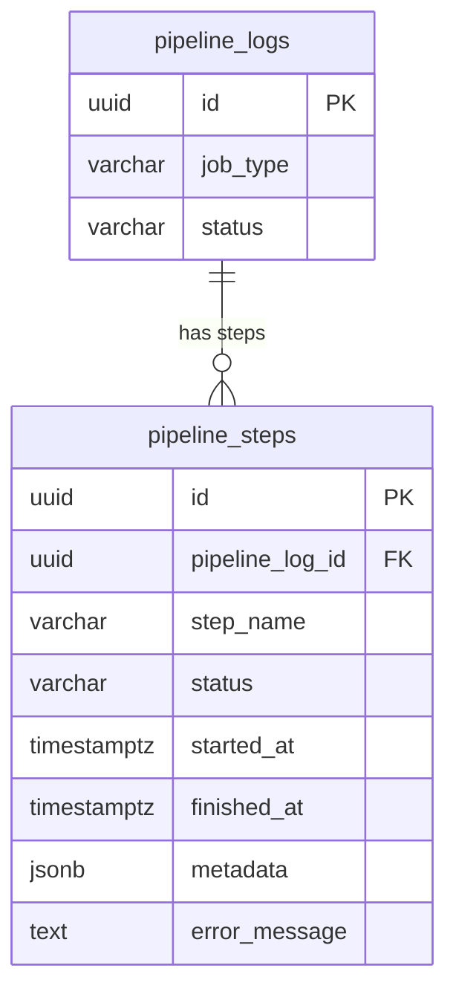

## Table Info
| Field | Value |
| :--- | :--- |
| Table | `pipeline_steps` |
| Engine | TimescaleDB (Postgres 16) |
| Model file | `backend/app/models/pipeline_step.py` |
| Primary key | UUID (uuid4) |

## Columns
| Column | Type | Nullable | Default | Notes |
| :--- | :--- | :--- | :--- | :--- |
| `id` | UUID | No | uuid4 | Primary key |
| `pipeline_log_id` | UUID | No | — | FK → `pipeline_logs.id` (CASCADE DELETE) |
| `step_name` | String | No | — | Human-readable step identifier |
| `status` | Enum | No | `"running"` | `running`, `done`, `failed` |
| `started_at` | DateTime(tz) | No | utcnow | Step start time |
| `finished_at` | DateTime(tz) | Yes | NULL | Step end time |
| `metadata` | JSONB | Yes | NULL | Arbitrary step data (mapped as `step_metadata`) |
| `error_message` | Text | Yes | NULL | Error detail if status = `failed` |

> Note: the Python attribute is `step_metadata` but the DB column name is `metadata` (via `name="metadata"` in `mapped_column`).

## Constraints & Indexes
| Name | Type | Columns |
| :--- | :--- | :--- |
| PK | PRIMARY KEY | `id` |
| FK to `pipeline_logs` | FOREIGN KEY (CASCADE) | `pipeline_log_id` |

## Entity Relationships



## SQLAlchemy Model (reference snapshot)

```python
class PipelineStep(Base):
    __tablename__ = "pipeline_steps"

    id: Mapped[uuid.UUID] = mapped_column(UUID(as_uuid=True), primary_key=True, default=uuid.uuid4)
    pipeline_log_id: Mapped[uuid.UUID] = mapped_column(
        UUID(as_uuid=True),
        ForeignKey("pipeline_logs.id", ondelete="CASCADE"),
        nullable=False,
    )
    step_name: Mapped[str] = mapped_column(nullable=False)
    status: Mapped[str] = mapped_column(
        Enum("running", "done", "failed", name="pipeline_step_status_enum"),
        nullable=False,
        default="running",
    )
    started_at: Mapped[datetime] = mapped_column(DateTime(timezone=True), default=lambda: datetime.now(timezone.utc))
    finished_at: Mapped[datetime | None] = mapped_column(DateTime(timezone=True), nullable=True)
    step_metadata: Mapped[dict | None] = mapped_column(JSONB, nullable=True, name="metadata")
    error_message: Mapped[str | None] = mapped_column(Text, nullable=True)

    pipeline_log: Mapped["PipelineLog"] = relationship("PipelineLog", back_populates="steps")
```

## TimescaleDB Notes

Standard Postgres table. Not a hypertable. Steps are child records of pipeline logs — discrete events, not time-series data.

## Service Layer
| Layer | File | Purpose |
| :--- | :--- | :--- |
| Service | `backend/app/services/pipeline.py` | Creates and updates step records during job execution |
| Schema | `backend/app/schemas/pipeline.py` | Pydantic serialization, included in PipelineLog response |

## Related
- DB - pipeline_logs
- `backend/app/services/pipeline.py`
- `backend/app/schemas/pipeline.py`
