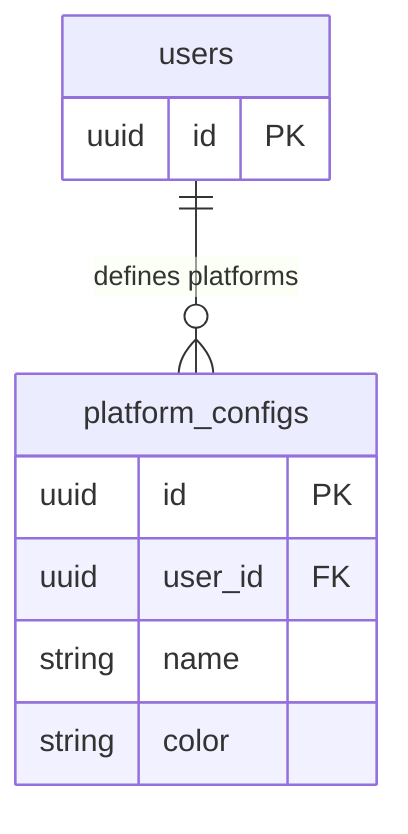

## Table Info
| Field | Value |
| :--- | :--- |
| Table | `platform_configs` |
| Engine | TimescaleDB (Postgres 16) |
| Model file | `backend/app/models/platform_config.py` |
| Primary key | UUID (`id`) |
| Purpose | Stores user-defined trading platform labels with display colors (e.g. "Robinhood" in green), used to tag portfolio holdings by brokerage |

## Columns
| Column | Type | Nullable | Default | Notes |
| :--- | :--- | :--- | :--- | :--- |
| `id` | UUID | NO | `uuid.uuid4()` | Primary key |
| `user_id` | UUID | NO | — | FK → `users.id` ON DELETE CASCADE; indexed |
| `name` | VARCHAR(100) | NO | — | Platform display name (unique per user) |
| `color` | VARCHAR(7) | NO | — | Hex color code (e.g. `#3B82F6`) |

## Constraints & Indexes
| Name | Type | Columns |
| :--- | :--- | :--- |
| `platform_configs_pkey` | PRIMARY KEY | `id` |
| `platform_configs_user_id_fkey` | FOREIGN KEY | `user_id` → `users.id` ON DELETE CASCADE |
| `uq_platform_configs_user_name` | UNIQUE | `(user_id, name)` |
| `ix_platform_configs_user_id` | INDEX | `user_id` |

## Entity Relationships


## SQLAlchemy Model (reference snapshot)
```python
class PlatformConfig(Base):
    __tablename__ = "platform_configs"
    __table_args__ = (UniqueConstraint("user_id", "name", name="uq_platform_configs_user_name"),)

    id: Mapped[uuid.UUID] = mapped_column(UUID(as_uuid=True), primary_key=True, default=uuid.uuid4)
    user_id: Mapped[uuid.UUID] = mapped_column(
        UUID(as_uuid=True), ForeignKey("users.id", ondelete="CASCADE"), nullable=False, index=True
    )
    name: Mapped[str] = mapped_column(String(100), nullable=False)
    color: Mapped[str] = mapped_column(String(7), nullable=False)
```

## TimescaleDB Notes
Standard Postgres table. Not a hypertable. Very low row count per user (typically < 20 platforms).

## Service Layer
| Layer | File | Purpose |
| :--- | :--- | :--- |
| API | `backend/app/api/platforms.py` | CRUD for platform configs |
| Service | `backend/app/services/system_backup.py` | Includes in backup/restore |

## Related
- DB - price_schedule_config
- DB - provider_configs
