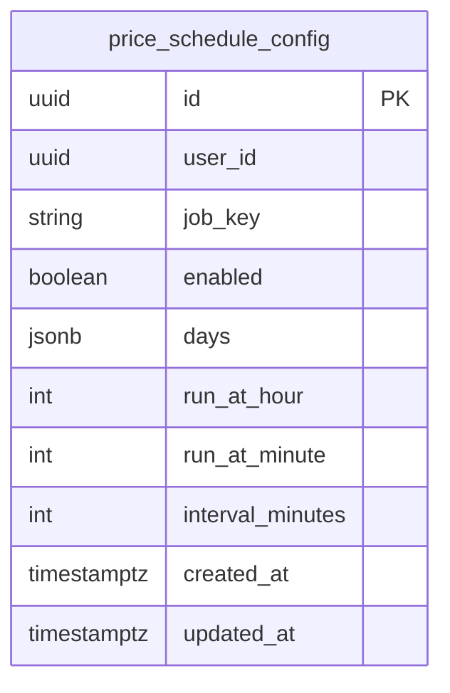

## Table Info
| Field | Value |
| :--- | :--- |
| Table | `price_schedule_config` |
| Engine | TimescaleDB (Postgres 16) |
| Model file | `backend/app/models/price_schedule_config.py` |
| Primary key | UUID (`id`) |
| Purpose | Stores per-user scheduled price fetch job configuration — defines which days, what time, and at what interval the ARQ worker should fetch asset prices |

## Columns
| Column | Type | Nullable | Default | Notes |
| :--- | :--- | :--- | :--- | :--- |
| `id` | UUID | NO | `uuid.uuid4()` | Primary key |
| `user_id` | UUID | NO | — | Owning user (no FK constraint); indexed |
| `job_key` | VARCHAR(50) | NO | — | Job identifier key (e.g. `fetch_prices`) |
| `enabled` | BOOLEAN | NO | `true` | Whether the schedule is active |
| `days` | JSONB | NO | `[]` | Array of day names or numbers to run the job |
| `run_at_hour` | INTEGER | NO | `0` | Hour of day to run (0-23) |
| `run_at_minute` | INTEGER | NO | `0` | Minute of hour to run (0-59) |
| `interval_minutes` | INTEGER | YES | `null` | If set, run every N minutes instead of at a fixed time |
| `created_at` | TIMESTAMPTZ | NO | `now()` | Record creation time |
| `updated_at` | TIMESTAMPTZ | NO | `now()` | Last update time |

## Constraints & Indexes
| Name | Type | Columns |
| :--- | :--- | :--- |
| `price_schedule_config_pkey` | PRIMARY KEY | `id` |
| `uq_user_job_key` | UNIQUE | `(user_id, job_key)` |
| `ix_price_schedule_config_user_id` | INDEX | `user_id` |

## Entity Relationships


## SQLAlchemy Model (reference snapshot)
```python
class PriceScheduleConfig(Base):
    __tablename__ = "price_schedule_config"
    __table_args__ = (UniqueConstraint("user_id", "job_key", name="uq_user_job_key"),)

    id: Mapped[uuid.UUID] = mapped_column(primary_key=True, default=uuid.uuid4)
    user_id: Mapped[uuid.UUID] = mapped_column(nullable=False, index=True)
    job_key: Mapped[str] = mapped_column(String(50), nullable=False)
    enabled: Mapped[bool] = mapped_column(Boolean(), nullable=False, default=True)
    days: Mapped[list] = mapped_column(JSONB(), nullable=False, default=list)
    run_at_hour: Mapped[int] = mapped_column(Integer(), nullable=False, default=0)
    run_at_minute: Mapped[int] = mapped_column(Integer(), nullable=False, default=0)
    interval_minutes: Mapped[int | None] = mapped_column(Integer(), nullable=True, default=None)
    created_at: Mapped[datetime] = mapped_column(
        DateTime(timezone=True), default=lambda: datetime.now(timezone.utc)
    )
    updated_at: Mapped[datetime] = mapped_column(
        DateTime(timezone=True), default=lambda: datetime.now(timezone.utc)
    )
```

## TimescaleDB Notes
Standard Postgres table. Not a hypertable. At most one row per `(user_id, job_key)` pair.

## Service Layer
| Layer | File | Purpose |
| :--- | :--- | :--- |
| Service | `backend/app/services/price_schedule_config.py` | CRUD and schedule resolution for price jobs |

## Related
- DB - platform_configs
- DB - provider_configs
