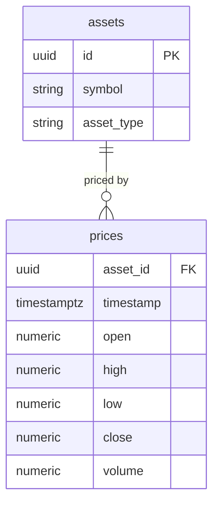

## Table Info
| Field | Value |
| :--- | :--- |
| Table | `prices` |
| Engine | TimescaleDB (Postgres 16) |
| Model file | `backend/app/models/price.py` |
| Primary key | Composite: `(asset_id, timestamp)` |

## Columns
| Column | Type | Nullable | Default | Notes |
| :--- | :--- | :--- | :--- | :--- |
| `asset_id` | UUID | No | — | PK (part 1), FK → `assets.id` |
| `timestamp` | DateTime(tz) | No | — | PK (part 2), candle open time |
| `open` | Numeric(20, 8) | Yes | `NULL` | Opening price of the candle |
| `high` | Numeric(20, 8) | Yes | `NULL` | Highest price in the period |
| `low` | Numeric(20, 8) | Yes | `NULL` | Lowest price in the period |
| `close` | Numeric(20, 8) | No | — | Closing / latest price (required) |
| `volume` | Numeric(20, 8) | Yes | `NULL` | Trade volume in the period |

## Constraints & Indexes
| Name | Type | Columns |
| :--- | :--- | :--- |
| `pk_prices` | PRIMARY KEY | `(asset_id, timestamp)` |
| `fk_prices_asset_id` | FOREIGN KEY | `asset_id` → `assets.id` |
| `ix_prices_asset_timestamp` | INDEX | `(asset_id, timestamp)` |

## Entity Relationships


## SQLAlchemy Model (reference snapshot)
```python
class Price(Base):
    __tablename__ = "prices"

    asset_id: Mapped[uuid.UUID] = mapped_column(
        UUID(as_uuid=True), ForeignKey("assets.id"), primary_key=True
    )
    timestamp: Mapped[datetime] = mapped_column(
        DateTime(timezone=True), primary_key=True
    )
    open: Mapped[Decimal | None] = mapped_column(Numeric(20, 8), nullable=True)
    high: Mapped[Decimal | None] = mapped_column(Numeric(20, 8), nullable=True)
    low: Mapped[Decimal | None] = mapped_column(Numeric(20, 8), nullable=True)
    close: Mapped[Decimal] = mapped_column(Numeric(20, 8), nullable=False)
    volume: Mapped[Decimal | None] = mapped_column(Numeric(20, 8), nullable=True)

    __table_args__ = (
        Index("ix_prices_asset_timestamp", "asset_id", "timestamp"),
    )
```

## TimescaleDB Notes
Currently a standard Postgres table, but it is the primary hypertable candidate in the schema. The composite PK `(asset_id, timestamp)` is already structured for TimescaleDB's chunk-based partitioning on `timestamp`. Migration path:

```sql
SELECT create_hypertable('prices', 'timestamp', if_not_exists => TRUE);
```

Once converted: compression on chunks older than 7 days and a retention policy (e.g., 2 years) would be appropriate. `close` is the only non-nullable OHLCV column because it is the minimum required for portfolio valuation; OHLV data may be unavailable for some asset types (e.g., gold spot, cash).

## Service Layer
| Layer | File | Purpose |
| :--- | :--- | :--- |
| Service | `app/services/price_feed.py` | Fetches and upserts price candles (background job via arq) |
| Service | `app/services/watchlist_alert.py` | Reads latest `close` to trigger price alerts |
| Service | `app/services/chat_tools.py` | Supplies current price context to AI chat |
| API Router | `app/api/assets.py` | Serves latest price per asset |
| API Router | `app/api/watchlist.py` | Returns price data for watchlist items |

## Related
- DB - assets
- DB - users
