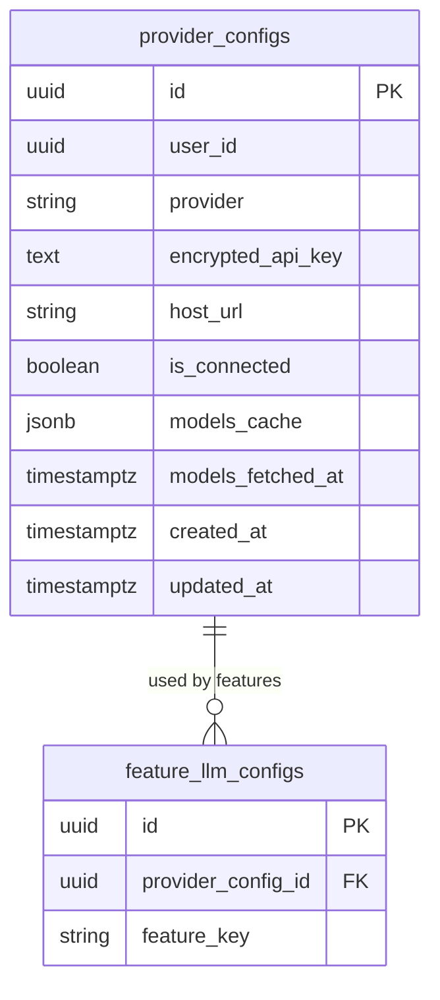

## Table Info
| Field | Value |
| :--- | :--- |
| Table | `provider_configs` |
| Engine | TimescaleDB (Postgres 16) |
| Model file | `backend/app/models/provider_config.py` |
| Primary key | UUID (`id`) |
| Purpose | Stores per-user LLM provider connections — encrypted API keys, optional custom host URL (for Ollama), connection status, and a cached list of available models |

## Columns
| Column | Type | Nullable | Default | Notes |
| :--- | :--- | :--- | :--- | :--- |
| `id` | UUID | NO | `uuid.uuid4()` | Primary key |
| `user_id` | UUID | NO | — | Owning user (no FK constraint); indexed |
| `provider` | VARCHAR(30) | NO | — | One of: `anthropic`, `openai`, `gemini`, `ollama`, `openrouter` |
| `encrypted_api_key` | TEXT | YES | — | Fernet-encrypted API key; NULL for local providers |
| `host_url` | VARCHAR(255) | YES | — | Custom host URL (used for Ollama / self-hosted) |
| `is_connected` | BOOLEAN | NO | `false` | Whether the last connection test succeeded |
| `models_cache` | JSONB | NO | `[]` | Cached list of models fetched from provider API |
| `models_fetched_at` | TIMESTAMPTZ | YES | — | When models cache was last refreshed |
| `created_at` | TIMESTAMPTZ | NO | `now()` | Record creation time |
| `updated_at` | TIMESTAMPTZ | NO | `now()` | Last update time (auto-updated via `onupdate`) |

### Valid `provider` Values
| Value | Notes |
| :--- | :--- |
| `anthropic` | Claude models |
| `openai` | GPT models |
| `gemini` | Google Gemini models |
| `ollama` | Local models via Ollama (`host_url` required) |
| `openrouter` | Multi-provider router |

## Constraints & Indexes
| Name | Type | Columns |
| :--- | :--- | :--- |
| `provider_configs_pkey` | PRIMARY KEY | `id` |
| `ix_provider_configs_user_id` | INDEX | `user_id` |

## Entity Relationships


## SQLAlchemy Model (reference snapshot)
```python
PROVIDERS = ("anthropic", "openai", "gemini", "ollama", "openrouter")

class ProviderConfig(Base):
    __tablename__ = "provider_configs"

    id: Mapped[uuid.UUID] = mapped_column(UUID(as_uuid=True), primary_key=True, default=uuid.uuid4)
    user_id: Mapped[uuid.UUID] = mapped_column(UUID(as_uuid=True), nullable=False, index=True)
    provider: Mapped[str] = mapped_column(String(30), nullable=False)
    encrypted_api_key: Mapped[str | None] = mapped_column(Text, nullable=True)
    host_url: Mapped[str | None] = mapped_column(String(255), nullable=True)
    is_connected: Mapped[bool] = mapped_column(Boolean, default=False)
    models_cache: Mapped[list] = mapped_column(JSONB, nullable=False, default=list)
    models_fetched_at: Mapped[datetime | None] = mapped_column(DateTime(timezone=True), nullable=True)
    created_at: Mapped[datetime] = mapped_column(
        DateTime(timezone=True), default=lambda: datetime.now(timezone.utc)
    )
    updated_at: Mapped[datetime] = mapped_column(
        DateTime(timezone=True), default=lambda: datetime.now(timezone.utc),
        onupdate=lambda: datetime.now(timezone.utc)
    )
```

## TimescaleDB Notes
Standard Postgres table. Not a hypertable. Typically one row per provider per user (5 providers max currently).

## Service Layer
| Layer | File | Purpose |
| :--- | :--- | :--- |
| API | `backend/app/api/provider_config.py` | CRUD, connection test, model list refresh |
| Service | `backend/app/services/llm_gateway.py` | Resolves provider config before LLM dispatch |
| Service | `backend/app/services/system_backup.py` | Includes in backup/restore |
| Tests | `backend/tests/test_system_backup.py` | Tests backup/restore for provider configs |

## Related
- DB - feature_llm_configs
- DB - llm_settings
- DB - ai_analyses
- DB - overview_analyses
