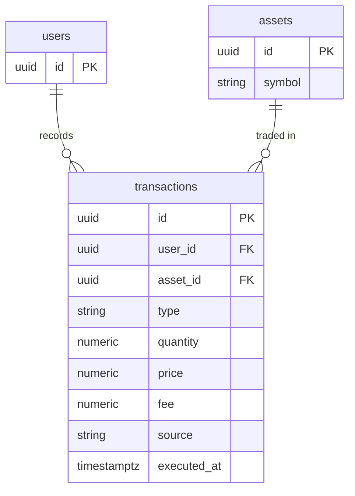

## Table Info
| Field | Value |
| :--- | :--- |
| Table | `transactions` |
| Engine | TimescaleDB (Postgres 16) |
| Model file | `backend/app/models/transaction.py` |
| Primary key | UUID (auto-generated via `uuid.uuid4`) |

## Columns
| Column | Type | Nullable | Default | Notes |
| :--- | :--- | :--- | :--- | :--- |
| `id` | UUID | No | `uuid.uuid4()` | Primary key |
| `user_id` | UUID | No | — | FK → `users.id`, indexed |
| `asset_id` | UUID | No | — | FK → `assets.id` |
| `platform` | String(100) | Yes | `None` | Broker/exchange where trade occurred |
| `type` | Enum(`transaction_type_enum`) | No | — | One of: `buy`, `sell`, `dividend`, `reward`, `fee`, `transfer` |
| `quantity` | Numeric(20, 8) | No | — | Number of units in the transaction |
| `price` | Numeric(20, 8) | No | — | Price per unit at execution |
| `fee` | Numeric(20, 8) | No | `Decimal("0")` | Brokerage/exchange fee |
| `source` | Enum(`transaction_source_enum`) | No | `"manual"` | One of: `manual`, `csv_import` |
| `executed_at` | DateTime(tz) | No | — | Actual trade execution timestamp |

## Constraints & Indexes
| Name | Type | Columns |
| :--- | :--- | :--- |
| `pk_transactions` | PRIMARY KEY | `id` |
| `fk_transactions_user_id` | FOREIGN KEY | `user_id` → `users.id` |
| `fk_transactions_asset_id` | FOREIGN KEY | `asset_id` → `assets.id` |
| `ix_transactions_user_id` | INDEX | `user_id` |
| `transaction_type_enum` | DB ENUM TYPE | `type` domain |
| `transaction_source_enum` | DB ENUM TYPE | `source` domain |

## Entity Relationships


## SQLAlchemy Model (reference snapshot)
```python
TRANSACTION_TYPES = ("buy", "sell", "dividend", "reward", "fee", "transfer")
TRANSACTION_SOURCES = ("manual", "csv_import")

class Transaction(Base):
    __tablename__ = "transactions"

    id: Mapped[uuid.UUID] = mapped_column(UUID(as_uuid=True), primary_key=True, default=uuid.uuid4)
    user_id: Mapped[uuid.UUID] = mapped_column(UUID(as_uuid=True), ForeignKey("users.id"), nullable=False, index=True)
    asset_id: Mapped[uuid.UUID] = mapped_column(UUID(as_uuid=True), ForeignKey("assets.id"), nullable=False)
    platform: Mapped[str | None] = mapped_column(String(100), nullable=True)
    type: Mapped[str] = mapped_column(
        Enum(*TRANSACTION_TYPES, name="transaction_type_enum"), nullable=False
    )
    quantity: Mapped[Decimal] = mapped_column(Numeric(20, 8), nullable=False)
    price: Mapped[Decimal] = mapped_column(Numeric(20, 8), nullable=False)
    fee: Mapped[Decimal] = mapped_column(Numeric(20, 8), nullable=False, default=Decimal("0"))
    source: Mapped[str] = mapped_column(
        Enum(*TRANSACTION_SOURCES, name="transaction_source_enum"), nullable=False, default="manual"
    )
    executed_at: Mapped[datetime] = mapped_column(DateTime(timezone=True), nullable=False)
```

## TimescaleDB Notes
Standard Postgres table. Not a hypertable. `executed_at` carries the time dimension and could be a hypertable candidate in future if transaction volume grows large enough to warrant chunk-based storage and compression.

## Service Layer
| Layer | File | Purpose |
| :--- | :--- | :--- |
| Service | `app/services/portfolio.py` | Reads transactions to compute P&L and cost basis |
| Service | `app/services/overview.py` | Aggregates transaction history for dashboard |
| Service | `app/services/net_worth_snapshot.py` | Uses transactions for historical net worth |
| Service | `app/services/price_feed.py` | Reads executed prices to inform price feed gaps |
| Service | `app/services/system_backup.py` | Exports transaction records |
| API Router | `app/api/import_pipeline.py` | Bulk CSV import of transactions |

## Related
- DB - users
- DB - assets
- DB - holdings
