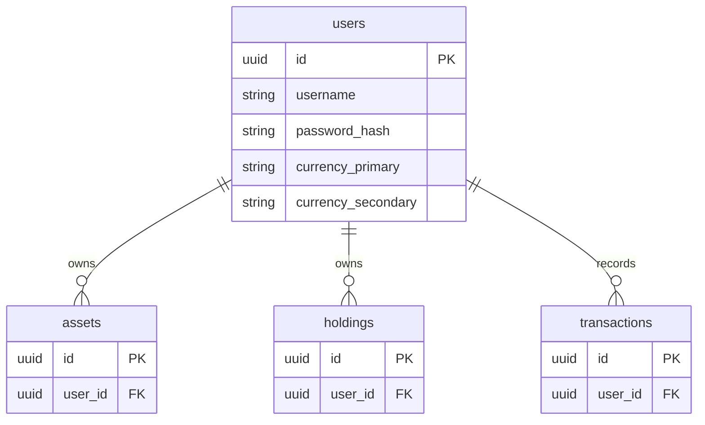

## Table Info
| Field | Value |
| :--- | :--- |
| Table | `users` |
| Engine | TimescaleDB (Postgres 16) |
| Model file | `backend/app/models/user.py` |
| Primary key | UUID (auto-generated via `uuid.uuid4`) |

## Columns
| Column | Type | Nullable | Default | Notes |
| :--- | :--- | :--- | :--- | :--- |
| `id` | UUID | No | `uuid.uuid4()` | Primary key |
| `username` | String(50) | No | — | Unique, indexed |
| `password_hash` | String(255) | No | — | bcrypt hash |
| `created_at` | DateTime(tz) | No | `datetime.now(utc)` | Account creation time |
| `currency_primary` | String(10) | No | `"THB"` | Primary display currency |
| `currency_secondary` | String(10) | No | `"USD"` | Secondary display currency |
| `birth_date` | Date | Yes | `None` | Used for retirement planning |
| `plan_to_age` | Integer | Yes | `85` (server default) | Target age for financial plan |
| `telegram_bot_token` | Text | Yes | `None` | Personal bot token for alerts |
| `telegram_chat_id` | String(100) | Yes | `None` | Telegram chat ID for alerts |
| `privacy_mode` | Boolean | No | `False` | Hides balances in UI |

## Constraints & Indexes
| Name | Type | Columns |
| :--- | :--- | :--- |
| `pk_users` | PRIMARY KEY | `id` |
| `uq_users_username` | UNIQUE | `username` |
| `ix_users_username` | INDEX | `username` |

## Entity Relationships


## SQLAlchemy Model (reference snapshot)
```python
class User(Base):
    __tablename__ = "users"

    id: Mapped[uuid.UUID] = mapped_column(
        primary_key=True, default=uuid.uuid4
    )
    username: Mapped[str] = mapped_column(String(50), unique=True, index=True)
    password_hash: Mapped[str] = mapped_column(String(255))
    created_at: Mapped[datetime] = mapped_column(
        DateTime(timezone=True),
        default=lambda: datetime.now(timezone.utc),
    )
    currency_primary: Mapped[str] = mapped_column(String(10), nullable=False, default="THB")
    currency_secondary: Mapped[str] = mapped_column(String(10), nullable=False, default="USD")
    birth_date: Mapped[Optional[date]] = mapped_column(Date(), nullable=True, default=None)
    plan_to_age: Mapped[Optional[int]] = mapped_column(Integer(), nullable=True, server_default="85")
    telegram_bot_token: Mapped[str | None] = mapped_column(Text(), nullable=True, default=None)
    telegram_chat_id: Mapped[str | None] = mapped_column(String(100), nullable=True, default=None)
    privacy_mode: Mapped[bool] = mapped_column(Boolean(), nullable=False, default=False)
```

## TimescaleDB Notes
Standard Postgres table. No hypertable, no compression policy, no retention policy. All time-series data lives in `prices`.

## Service Layer
| Layer | File | Purpose |
| :--- | :--- | :--- |
| API Router | `app/api/auth.py` | Registration, login, JWT issuance |
| API Router | `app/api/settings.py` | Update user profile / preferences |
| API Router | `app/api/deps.py` | `get_current_user` dependency injection |
| Service | `app/services/auth.py` | Password hashing, token validation |
| Service | `app/services/llm_gateway.py` | Resolves user-level LLM provider config |
| Service | `app/services/price_feed.py` | Filters price jobs by user ownership |
| Service | `app/services/system_backup.py` | Exports user data for backup |

## Related
- DB - assets
- DB - holdings
- DB - transactions
