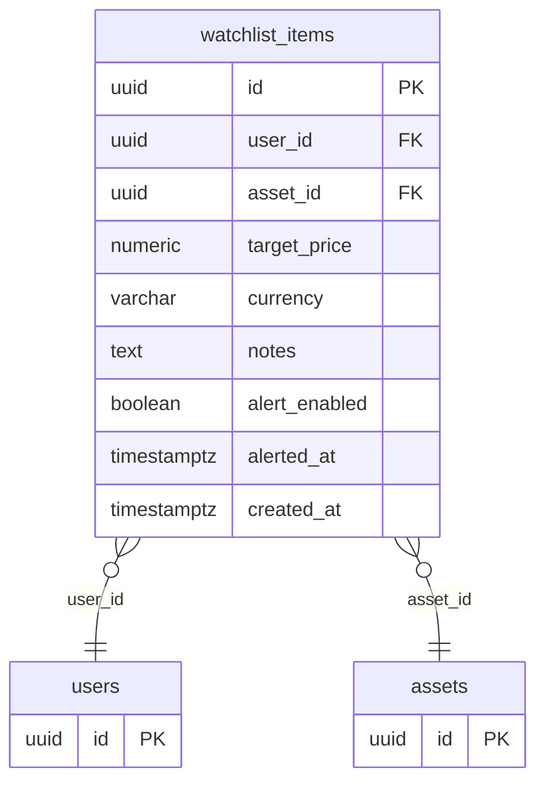

## Table Info
| Field | Value |
| :--- | :--- |
| Table | `watchlist_items` |
| Engine | TimescaleDB (Postgres 16) |
| Model file | `backend/app/models/watchlist_item.py` |
| Primary key | UUID (`id`) |

## Columns
| Column | Type | Nullable | Default | Notes |
| :--- | :--- | :--- | :--- | :--- |
| `id` | UUID | No | `uuid.uuid4` | Primary key |
| `user_id` | UUID | No | — | FK → `users.id`, indexed |
| `asset_id` | UUID | No | — | FK → `assets.id` |
| `target_price` | Numeric(20,8) | Yes | NULL | Optional price alert threshold |
| `currency` | String(10) | No | `"USD"` | Currency for the target price |
| `notes` | Text | Yes | NULL | Optional user notes |
| `alert_enabled` | Boolean | No | `True` | Whether price alerts are active |
| `alerted_at` | DateTime(tz) | Yes | NULL | Timestamp of last alert fired |
| `created_at` | DateTime(tz) | No | `datetime.now(UTC)` | Record creation timestamp |

## Constraints & Indexes
| Name | Type | Columns |
| :--- | :--- | :--- |
| `watchlist_items_pkey` | Primary Key | `id` |
| `uq_watchlist_user_asset` | Unique Constraint | `user_id`, `asset_id` |
| `ix_watchlist_items_user_id` | Index | `user_id` |
| FK on `user_id` | Foreign Key | `user_id` → `users.id` |
| FK on `asset_id` | Foreign Key | `asset_id` → `assets.id` |

## Entity Relationships


## SQLAlchemy Model (reference snapshot)
```python
class WatchlistItem(Base):
    __tablename__ = "watchlist_items"

    id: Mapped[uuid.UUID] = mapped_column(UUID(as_uuid=True), primary_key=True, default=uuid.uuid4)
    user_id: Mapped[uuid.UUID] = mapped_column(UUID(as_uuid=True), ForeignKey("users.id"), nullable=False, index=True)
    asset_id: Mapped[uuid.UUID] = mapped_column(UUID(as_uuid=True), ForeignKey("assets.id"), nullable=False)
    target_price: Mapped[Decimal | None] = mapped_column(Numeric(20, 8), nullable=True)
    currency: Mapped[str] = mapped_column(String(10), nullable=False, default="USD")
    notes: Mapped[str | None] = mapped_column(Text(), nullable=True)
    alert_enabled: Mapped[bool] = mapped_column(Boolean(), nullable=False, default=True)
    alerted_at: Mapped[datetime | None] = mapped_column(DateTime(timezone=True), nullable=True)
    created_at: Mapped[datetime] = mapped_column(
        DateTime(timezone=True), default=lambda: datetime.now(timezone.utc)
    )

    __table_args__ = (
        UniqueConstraint("user_id", "asset_id", name="uq_watchlist_user_asset"),
    )
```

## TimescaleDB Notes
- Not a hypertable. This is a low-cardinality, user-mutable reference table (not a time-series append log).
- `alerted_at` records the last alert time but is not used for time-partitioning.

## Service Layer
| Layer | File | Purpose |
| :--- | :--- | :--- |
| API Router | `backend/app/api/watchlist.py` | REST endpoints for watchlist CRUD |
| Service | `backend/app/services/watchlist_alert.py` | Alert evaluation and `alerted_at` updates |
| Service | `backend/app/services/chat_tools.py` | LLM chat tool reads watchlist |
| Service | `backend/app/services/ipo_feed.py` | Checks if new IPOs are on user watchlists |
| Service | `backend/app/services/system_backup.py` | Backup export |
| Worker Job | `backend/worker/jobs/watchlist_discover.py` | Discovers new assets matching watchlist criteria |
| Worker Job | `backend/worker/jobs/watchlist_scan.py` | Scans prices and triggers alerts |

## Related
- DB - watchlist_suggestions
- DB - assets
- DB - users
