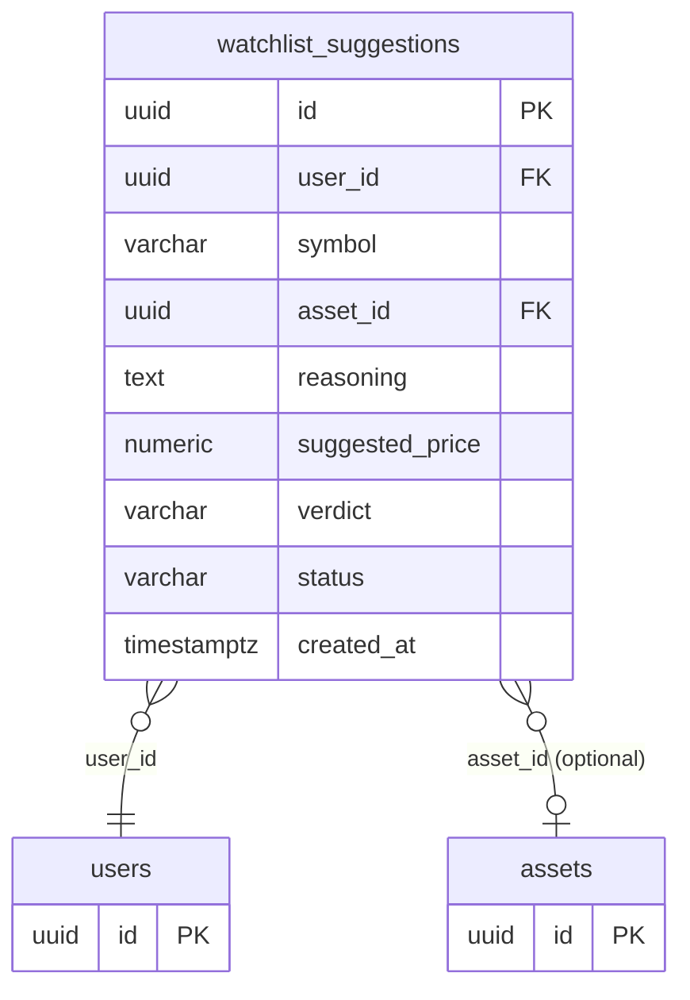

## Table Info
| Field | Value |
| :--- | :--- |
| Table | `watchlist_suggestions` |
| Engine | TimescaleDB (Postgres 16) |
| Model file | `backend/app/models/watchlist_suggestion.py` |
| Primary key | UUID (`id`) |

## Columns
| Column | Type | Nullable | Default | Notes |
| :--- | :--- | :--- | :--- | :--- |
| `id` | UUID | No | `uuid.uuid4` | Primary key |
| `user_id` | UUID | No | — | FK → `users.id`, indexed |
| `symbol` | String(20) | No | — | Ticker symbol of the suggested asset |
| `asset_id` | UUID | Yes | NULL | Optional FK → `assets.id` (may not exist yet) |
| `reasoning` | Text | No | — | LLM-generated rationale for the suggestion |
| `suggested_price` | Numeric(20,8) | Yes | NULL | Optional price at time of suggestion |
| `verdict` | String(10) | No | — | LLM verdict (e.g. "buy", "watch", "avoid") |
| `status` | String(20) | No | `"pending"` | Workflow state: pending / accepted / dismissed |
| `created_at` | DateTime(tz) | No | `datetime.now(UTC)` | Record creation timestamp |

## Constraints & Indexes
| Name | Type | Columns |
| :--- | :--- | :--- |
| `watchlist_suggestions_pkey` | Primary Key | `id` |
| `ix_watchlist_suggestions_user_id` | Index | `user_id` |
| FK on `user_id` | Foreign Key | `user_id` → `users.id` |
| FK on `asset_id` | Foreign Key (nullable) | `asset_id` → `assets.id` |

## Entity Relationships


## SQLAlchemy Model (reference snapshot)
```python
class WatchlistSuggestion(Base):
    __tablename__ = "watchlist_suggestions"

    id: Mapped[uuid.UUID] = mapped_column(UUID(as_uuid=True), primary_key=True, default=uuid.uuid4)
    user_id: Mapped[uuid.UUID] = mapped_column(UUID(as_uuid=True), ForeignKey("users.id"), nullable=False, index=True)
    symbol: Mapped[str] = mapped_column(String(20), nullable=False)
    asset_id: Mapped[uuid.UUID | None] = mapped_column(UUID(as_uuid=True), ForeignKey("assets.id"), nullable=True)
    reasoning: Mapped[str] = mapped_column(Text, nullable=False)
    suggested_price: Mapped[Decimal | None] = mapped_column(Numeric(20, 8), nullable=True)
    verdict: Mapped[str] = mapped_column(String(10), nullable=False)
    status: Mapped[str] = mapped_column(String(20), nullable=False, default="pending")
    created_at: Mapped[datetime] = mapped_column(
        DateTime(timezone=True), default=lambda: datetime.now(timezone.utc)
    )
```

## TimescaleDB Notes
- Not a hypertable. Suggestions are a low-volume, user-facing workflow table.
- `created_at` provides chronological ordering but volume does not justify time-partitioning.

## Service Layer
| Layer | File | Purpose |
| :--- | :--- | :--- |
| API Router | `backend/app/api/watchlist.py` | REST endpoints to list, accept, or dismiss suggestions |
| Worker Job | `backend/worker/jobs/watchlist_discover.py` | AI-driven job that generates new suggestions and writes rows |

## Related
- DB - watchlist_items
- DB - assets
- DB - users
