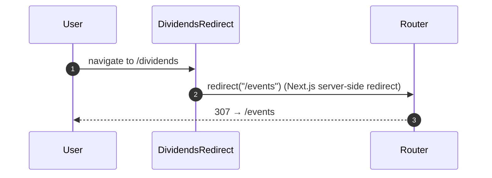

## Route
| Field | Value |
| :--- | :--- |
| Path | `/dividends` |
| Auth guard | `(auth)` layout group |
| File | `frontend/app/(auth)/dividends/page.tsx` |

## Component Tree
```
DividendsRedirect
└── (no render — redirects immediately to /events)
```

## Data Layer

### Server State — React Query
| Query key | Endpoint | Purpose |
| :--- | :--- | :--- |
| Not used | — | Page performs an immediate redirect |

### Global State — Zustand
| Store | Fields used |
| :--- | :--- |
| None | — |

### Local State — `useState`
| Variable | Type | Purpose |
| :--- | :--- | :--- |
| None | — | — |

## Page Lifecycle


## Validation & Conditions

### Form Validation (if any)
| Rule | Where enforced |
| :--- | :--- |
| None | — |

### Render Conditions
| Condition | Rendered |
| :--- | :--- |
| Always | Redirect to `/events` — nothing rendered |

## Related
- Page - Events
