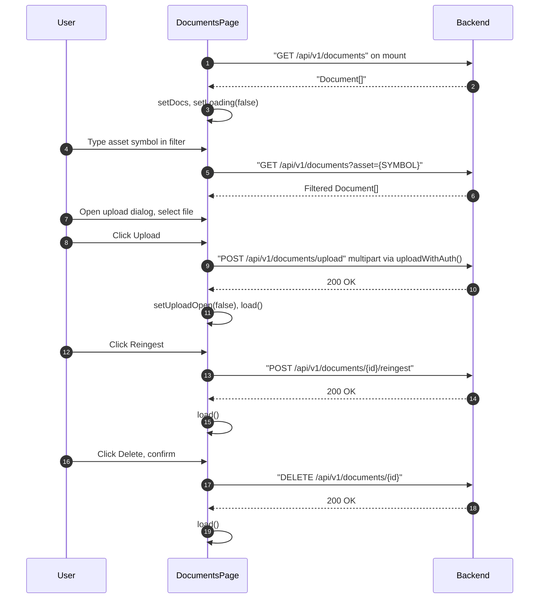

## Route
| Field | Value |
| :--- | :--- |
| Path | `/documents` |
| Auth guard | `(auth)` layout |
| File | `frontend/app/(auth)/documents/page.tsx` |

## Component Tree
```
DocumentsPage
├── PageHeader (title="Documents")
├── Filter Input (asset symbol filter)
├── Dialog (upload trigger)
│   ├── DialogTrigger — Button "Upload Document"
│   └── DialogContent
│       ├── Input (asset symbol)
│       ├── Select (doc_type — research/annual_report/earnings/news/general)
│       ├── Input type="file" (via fileRef)
│       └── Button "Upload"
├── Table (shadcn)
│   ├── TableHeader
│   └── TableBody
│       └── TableRow (per document)
│           ├── Badge (status — pending/processing/done/failed)
│           ├── filename, asset_id, chunk_count, created_at
│           ├── Button "Reingest"
│           └── Button "Delete"
└── Skeleton (loading state)
```

## Data Layer

### Server State — React Query
None — uses direct `api.get` + `useEffect`.

### Global State — Zustand
None.

### Local State — useState
| Variable | Type | Purpose |
| :--- | :--- | :--- |
| `docs` | `Document[]` | List of documents from API |
| `loading` | `boolean` | Initial fetch loading state |
| `filter` | `string` | Asset symbol filter string |
| `uploading` | `boolean` | Upload in-flight flag |
| `uploadOpen` | `boolean` | Upload dialog open/close |
| `assetSymbol` | `string` | Asset symbol for upload form |
| `docType` | `string` | Document type for upload (default `"research"`) |

### Refs
| Ref | Purpose |
| :--- | :--- |
| `fileRef` | Hidden `<input type="file">` for file selection |

## Page Lifecycle


## Validation & Conditions

### Form Validation
- `handleUpload()` returns early if `fileRef.current?.files?.[0]` is falsy.
- Asset symbol is uppercased before sending (`assetSymbol.toUpperCase()`).
- Upload uses `uploadWithAuth()` instead of `api` — reads `access_token` from `localStorage` and sets `Authorization` header manually (because `api` forces `application/json`, incompatible with `multipart/form-data`).

### Render Conditions
| Condition | Rendered |
| :--- | :--- |
| `loading === true` | Skeleton rows |
| `docs.length === 0` | Empty state |
| `status === "processing"` | Badge with `animate-pulse` |
| `status === "failed"` | Red badge + `error_msg` visible |
| `uploadOpen === true` | Upload dialog visible |

## Related
- Page - Research
- `frontend/lib/api.ts`
- `frontend/app/(auth)/documents/page.tsx`
