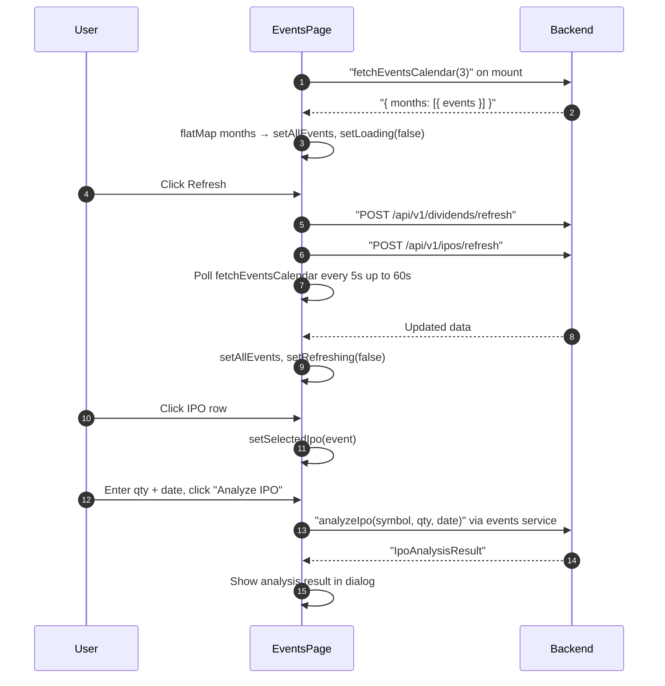

## Route
| Field | Value |
| :--- | :--- |
| Path | `/events` |
| Auth guard | `(auth)` layout |
| File | `frontend/app/(auth)/events/page.tsx` |

## Component Tree
```
EventsPage
├── PageHeader (title="Events")
├── Filter bar
│   ├── Button group (All / Dividends / IPOs / Watchlist)
│   └── Button "Refresh" (RefreshCw icon)
├── Events Table (shadcn)
│   ├── TableHeader
│   └── TableBody
│       └── TableRow (per CalendarEvent)
│           ├── TickerLogo
│           ├── event_type badge (STATUS_BADGE)
│           ├── event_date, details (amount/price)
│           └── Button (dividend detail / IPO analyze)
├── Dialog — Dividend Detail
│   └── DividendCalendarEvent fields
├── Dialog — IPO Detail + Analyze
│   ├── IpoCalendarEvent fields
│   ├── Input (confirmQty)
│   ├── DatePicker (confirmDate)
│   └── Button "Analyze IPO"
└── Skeleton (loading state)
```

## Data Layer

### Server State — React Query
None — uses direct `fetchEventsCalendar` + `useEffect`.

### Global State — Zustand
None (uses `useDualCurrency` hook).

### Local State — useState
| Variable | Type | Purpose |
| :--- | :--- | :--- |
| `allEvents` | `CalendarEvent[]` | Flattened events from 3-month calendar fetch |
| `loading` | `boolean` | Initial load skeleton |
| `fetchError` | `string \| null` | Error message if fetch fails |
| `refreshing` | `boolean` | Refresh button in-flight |
| `filter` | `FilterType` | Active tab — `"all" \| "dividend" \| "ipo" \| "watchlist"` |
| `selectedDividend` | `DividendCalendarEvent \| null` | Dividend detail dialog target |
| `selectedIpo` | `IpoCalendarEvent \| null` | IPO detail dialog target |
| `confirmQty` | `string` | IPO confirm quantity input |
| `confirmDate` | `string` | IPO confirm date input |
| `confirming` | `boolean` | IPO analyze in-flight |

### Derived State (useMemo)
- `filteredEvents` — `allEvents` filtered by `filter` and `is_in_watchlist`.

## Page Lifecycle


## Validation & Conditions

### Form Validation
- IPO confirm form: `confirmQty` and `confirmDate` must be provided before `analyzeIpo()` is called.
- Refresh uses a polling loop (5-second intervals, 60-second timeout) because dividend/IPO refresh jobs are async background tasks.

### Render Conditions
| Condition | Rendered |
| :--- | :--- |
| `loading === true` | Skeleton rows |
| `fetchError !== null` | Error alert banner |
| `filter === "dividend"` | Only dividend events |
| `filter === "ipo"` | Only IPO events |
| `filter === "watchlist"` | Only events where `is_in_watchlist === true` |
| `selectedDividend !== null` | Dividend detail dialog |
| `selectedIpo !== null` | IPO detail + analyze dialog |
| `refreshing === true` | Refresh button disabled + spinner |

## Related
- `frontend/lib/services/events.ts`
- `frontend/components/ui/TickerLogo.tsx`
- `frontend/hooks/useDualCurrency.ts`
