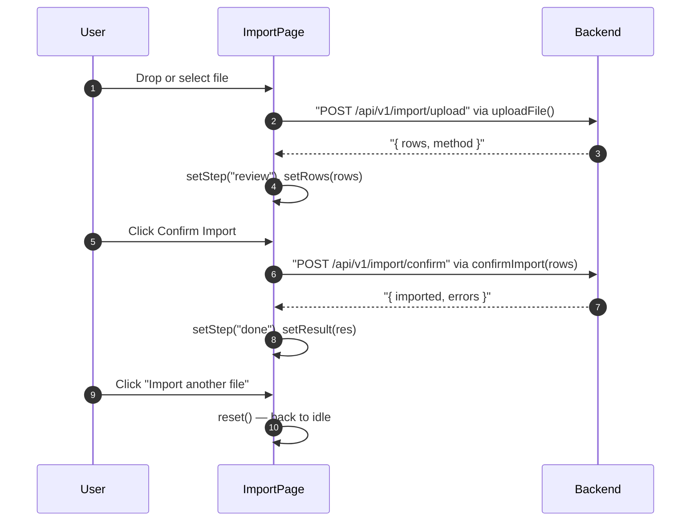

## Route
| Field | Value |
| :--- | :--- |
| Path | `/import` |
| Auth guard | `(auth)` layout |
| File | `frontend/app/(auth)/import/page.tsx` |

## Component Tree
```
ImportPage
├── PageHeader (title="Import")
├── [idle] — drop zone / file input (drag-and-drop area)
│   └── Button (Upload icon)
├── [uploading] — loading skeleton / spinner
├── [review] — ReviewTable
│   ├── (shows parsed CanonicalRow[] before commit)
│   ├── Button "Confirm Import"
│   └── Button "Cancel"
├── [confirming] — spinner
└── [done] — CheckCircle success card
    └── Button "Import another file"
```

## Data Layer

### Server State — React Query
None — uses direct `fetch` via service functions.

### Global State — Zustand
None.

### Local State — useState
| Variable | Type | Purpose |
| :--- | :--- | :--- |
| `step` | `"idle" \| "uploading" \| "review" \| "confirming" \| "done"` | Multi-step wizard state machine |
| `rows` | `CanonicalRow[]` | Parsed canonical rows returned from upload |
| `method` | `"direct" \| "llm_translated"` | How the file was parsed (direct CSV or LLM translation) |
| `result` | `{ imported: number; errors: unknown[] } \| null` | Final import result summary |

## Page Lifecycle


## Validation & Conditions

### Form Validation
- File must be selected before upload proceeds.
- If `uploadFile()` throws, toast error shown and step returns to `"idle"`.
- If `confirmImport()` throws, toast error shown and step returns to `"review"`.

### Render Conditions
| Condition | Rendered |
| :--- | :--- |
| `step === "idle"` | File drop/select zone |
| `step === "uploading"` | Loading state |
| `step === "review"` | ReviewTable with rows + Confirm/Cancel buttons |
| `step === "confirming"` | Spinner while committing |
| `step === "done"` | Success card with import count |

## Related
- Page - Transactions
- `frontend/lib/services/import-pipeline.ts`
- `frontend/components/import/ReviewTable.tsx`
