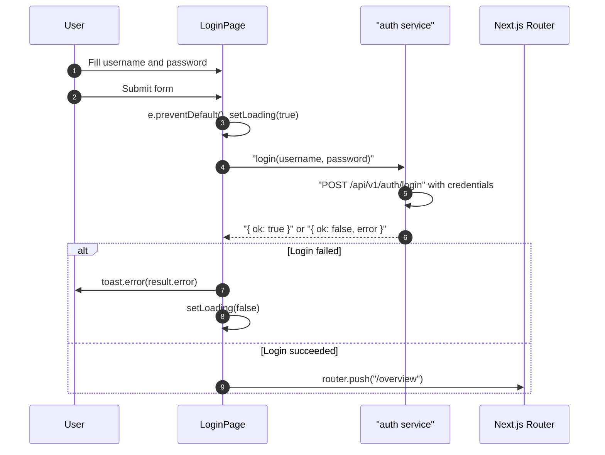

## Route
| Field | Value |
| :--- | :--- |
| Path | `/login` |
| Auth guard | None — public route |
| File | `frontend/app/login/page.tsx` |

## Component Tree
```
LoginPage
└── div (min-h-screen centered)
    └── Card (max-w-sm)
        ├── CardHeader
        │   ├── CardTitle "Zentri"
        │   └── p "Sign in to your financial OS"
        └── CardContent
            ├── form (onSubmit=handleLogin)
            │   ├── Label + Input (username — required)
            │   ├── Label + Input (password — type="password", required)
            │   └── Button "Sign in" (disabled while loading)
            └── p — link to /setup (first-time users)
```

## Data Layer

### Server State — React Query
None.

### Global State — Zustand
None.

### Local State — useState
| Variable | Type | Purpose |
| :--- | :--- | :--- |
| `username` | `string` | Controlled username input |
| `password` | `string` | Controlled password input |
| `loading` | `boolean` | In-flight submit state — disables button |

## Page Lifecycle


## Validation & Conditions

### Form Validation
- Both `username` and `password` inputs have `required` attribute — browser prevents empty submission.
- No client-side length or pattern validation beyond HTML `required`.
- Server error is displayed via `toast.error(result.error)` if `result.ok === false`.

### Render Conditions
| Condition | Rendered |
| :--- | :--- |
| `loading === true` | Button text "Signing in...", button disabled |
| `loading === false` | Button text "Sign in", button enabled |
| Always | Link to `/setup` for first-time users |

## Related
- Page - Setup
- Page - Overview
- `frontend/lib/services/auth.ts`
