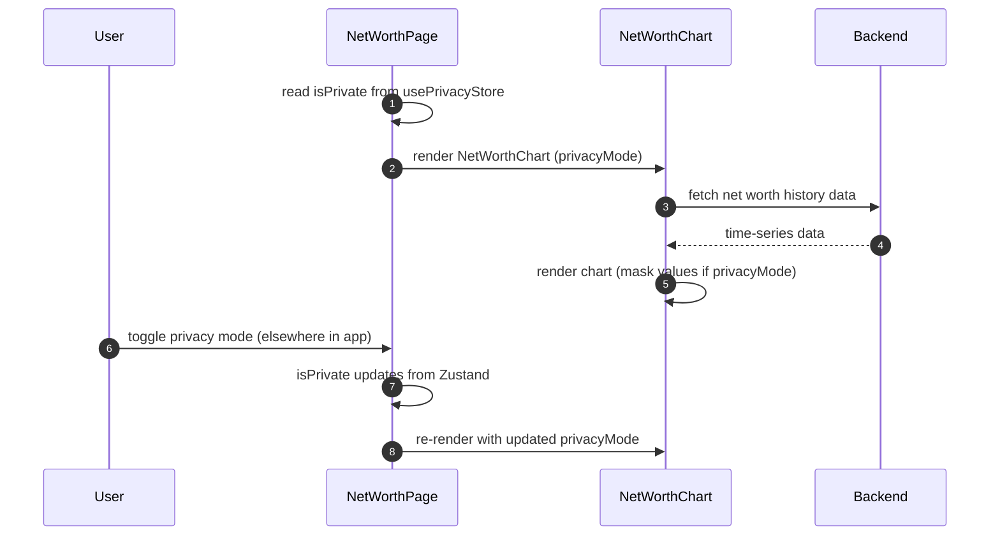

## Route
| Field | Value |
| :--- | :--- |
| Path | `/net-worth` |
| Auth guard | `(auth)` layout group |
| File | `frontend/app/(auth)/net-worth/page.tsx` |

## Component Tree
```
NetWorthPage
├── PageHeader (title: "Net Worth")
└── NetWorthChart (privacyMode={isPrivate})
```

## Data Layer

### Server State — React Query
| Query key | Endpoint | Purpose |
| :--- | :--- | :--- |
| Not used directly | — | Data fetching is handled inside `NetWorthChart` component |

### Global State — Zustand
| Store | Fields used |
| :--- | :--- |
| `usePrivacyStore` (`@/store/privacy`) | `isPrivate` — passed to `NetWorthChart` to mask monetary values |

### Local State — `useState`
| Variable | Type | Purpose |
| :--- | :--- | :--- |
| None | — | Page is fully stateless; all logic lives in `NetWorthChart` |

## Page Lifecycle


## Validation & Conditions

### Form Validation (if any)
| Rule | Where enforced |
| :--- | :--- |
| None | Read-only chart page |

### Render Conditions
| Condition | Rendered |
| :--- | :--- |
| Always | `NetWorthChart` is always rendered |
| `isPrivate === true` | `NetWorthChart` masks monetary values via `privacyMode` prop |

## Related
- Component - NetWorthChart
- DB - net_worth_snapshots
