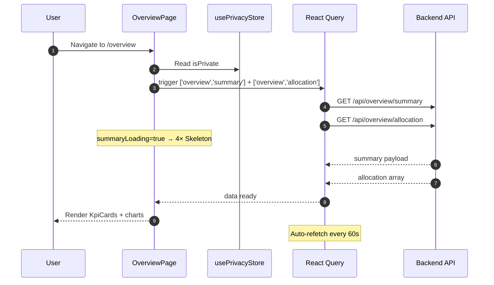

> Purpose: The home dashboard — shows the user's complete financial snapshot: KPI cards, net worth history, performance chart, asset allocation donut, and an AI analysis card.

## Route

| Property | Value |
| :--- | :--- |
| **Path** | `/overview` |
| **File** | `app/(auth)/overview/page.tsx` |
| **Auth Required** | Yes — enforced by `(auth)` route group layout |
| **Layout** | `app/(auth)/layout.tsx` |
| **Dynamic Segment** | None |


## Component Tree

```
OverviewPage (page.tsx)
├── PageHeader (title="Overview")
├── KpiCards (summary)              ← conditional on summary loaded
│   └── [4× Skeleton h-24]         ← shown while summaryLoading
├── NetWorthChart (privacyMode)
├── [grid lg:col-span-3]
│   └── PerformanceChart
├── [grid lg:col-span-2]
│   └── AllocationDonut (allocation)
└── AIAnalysisCard
```


## Data Layer

### Server State — React Query

| Query Key | Service Function | Endpoint | Refetch Interval | Stale Time |
| :--- | :--- | :--- | :--- | :--- |
| `['overview', 'summary']` | `fetchOverviewSummary` | `GET /api/overview/summary` | 60 s | default |
| `['overview', 'allocation']` | `fetchAllocation` | `GET /api/overview/allocation` | 60 s | default |

Both queries auto-refetch every 60 seconds to keep financial data live.

### Global State — Zustand

| Store | Fields Read | Actions Called |
| :--- | :--- | :--- |
| `usePrivacyStore` | `isPrivate` | — |

`isPrivate` is passed as `privacyMode` prop to `NetWorthChart` to blur monetary values.

### Local State — `useState`

None — all state is server state (React Query) or global (Zustand).


## Page Lifecycle




## Validation & Conditions

### Render Conditions

| Condition | What Shows |
| :--- | :--- |
| `summaryLoading === true` | 4× `<Skeleton className="h-24 rounded-2xl">` in 2–4 col grid |
| `summary` truthy | `<KpiCards summary={summary}>` |
| `summary` falsy + not loading | Nothing (null) — no error state shown |
| `isPrivate === true` | `NetWorthChart` blurs/hides monetary values |
| `allocation` empty | `AllocationDonut` receives `[]` (handles empty state internally) |

> Missing Error State: If the summary query errors, the KPI section silently disappears (returns null). No error callout is shown to the user. Consider adding `isError` handling.


## Related

| Role | Link |
| :--- | :--- |
| Privacy Store | Store - Privacy |
| Palette Store | Store - Palette |
| Net Worth Page | Page - Net Worth |
