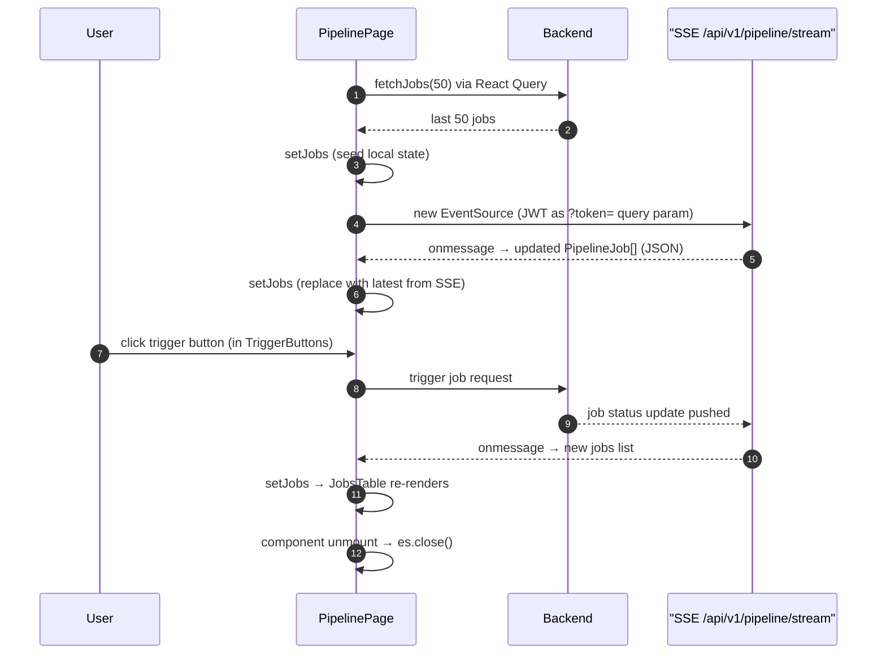

## Route
| Field | Value |
| :--- | :--- |
| Path | `/pipeline` |
| Auth guard | `(auth)` layout group |
| File | `frontend/app/(auth)/pipeline/page.tsx` |

## Component Tree
```
PipelinePage
├── PageHeader (title: "Pipeline")
├── [loading state] → Skeleton (8 rows)
├── p (subtitle: "Live price fetch job status...")
├── TriggerButtons
└── JobsTable (jobs={jobs})
```

## Data Layer

### Server State — React Query
| Query key | Endpoint | Purpose |
| :--- | :--- | :--- |
| `["pipeline-jobs"]` | `fetchJobs(50)` | Initial load of last 50 pipeline jobs |

### Global State — Zustand
| Store | Fields used |
| :--- | :--- |
| None | — |

### Local State — `useState`
| Variable | Type | Purpose |
| :--- | :--- | :--- |
| `jobs` | `PipelineJob[]` | Live job list, seeded from React Query then updated by SSE |

## Page Lifecycle


## Validation & Conditions

### Form Validation (if any)
| Rule | Where enforced |
| :--- | :--- |
| None | Page is read-only except for trigger actions in `TriggerButtons` |

### Render Conditions
| Condition | Rendered |
| :--- | :--- |
| `isLoading` is true | 8-row Skeleton placeholder |
| `isLoading` is false | Full page with `TriggerButtons` + `JobsTable` |
| `jobs.length === 0` | `JobsTable` renders empty state (handled internally) |

## Related
- Component - JobsTable
- Component - TriggerButtons
