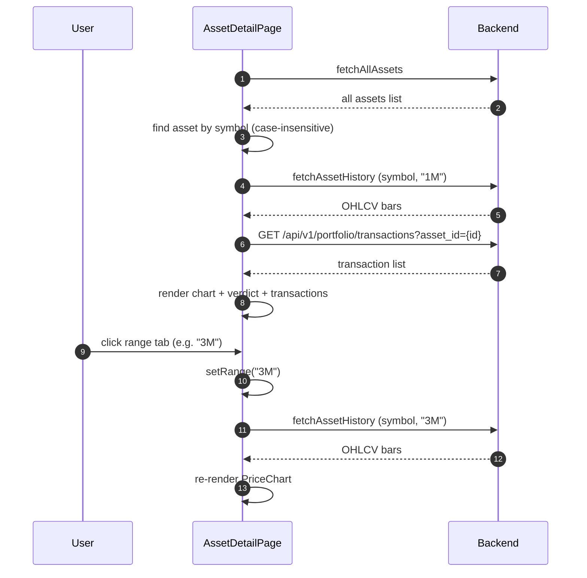

## Route
| Field | Value |
| :--- | :--- |
| Path | `/portfolio/[symbol]` |
| Auth guard | `(auth)` layout group |
| File | `frontend/app/(auth)/portfolio/[symbol]/page.tsx` |

## Component Tree
```
AssetDetailPage
├── PageHeader
├── TickerLogo
├── Badge (asset type)
├── Tabs (range selector: 1W / 1M / 3M / 1Y)
│   └── TabsTrigger (per range)
├── [chart area]
│   ├── Skeleton (while historyLoading)
│   └── PriceChart
├── VerdictCard
└── [transactions table]
    ├── PrivacyValue (quantity, price, fee)
    └── DualCurrencyAmount
```

## Data Layer

### Server State — React Query
| Query key | Endpoint | Purpose |
| :--- | :--- | :--- |
| `["assets"]` | `fetchAllAssets()` | Resolve asset metadata (id, currency) from symbol |
| `["asset-history", symbol, range]` | `fetchAssetHistory(symbol, range)` | OHLCV bars for the selected time range |
| `["transactions", asset?.id]` | `GET /api/v1/portfolio/transactions?asset_id={asset.id}` | Transaction history for this asset |

### Global State — Zustand
| Store | Fields used |
| :--- | :--- |
| None | — |

### Local State — `useState`
| Variable | Type | Purpose |
| :--- | :--- | :--- |
| `range` | `"1W" \| "1M" \| "3M" \| "1Y"` | Selected price chart time range (default: "1M") |

## Page Lifecycle


## Validation & Conditions

### Form Validation (if any)
| Rule | Where enforced |
| :--- | :--- |
| None | Read-only page |

### Render Conditions
| Condition | Rendered |
| :--- | :--- |
| `assetsLoading` is true | Full-page loading skeleton (implicit via missing `asset`) |
| `historyLoading` is true | `Skeleton` with `h-[300px]` in chart area |
| `asset` not found in list | Chart and transactions cannot render (asset is undefined) |
| `!txData?.length` | "No transactions recorded" empty state row |
| `asset?.currency` | Asset currency drives `DualCurrencyAmount` formatting |

## Related
- Component - PriceChart
- Component - VerdictCard
- Page - Portfolio
